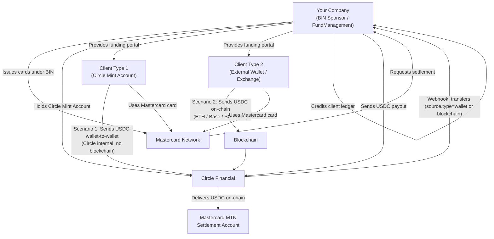
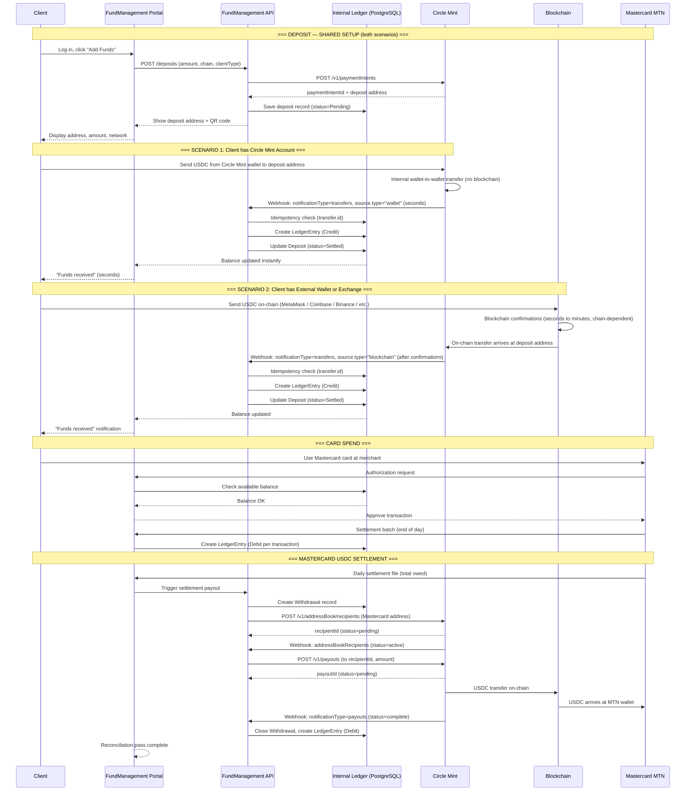
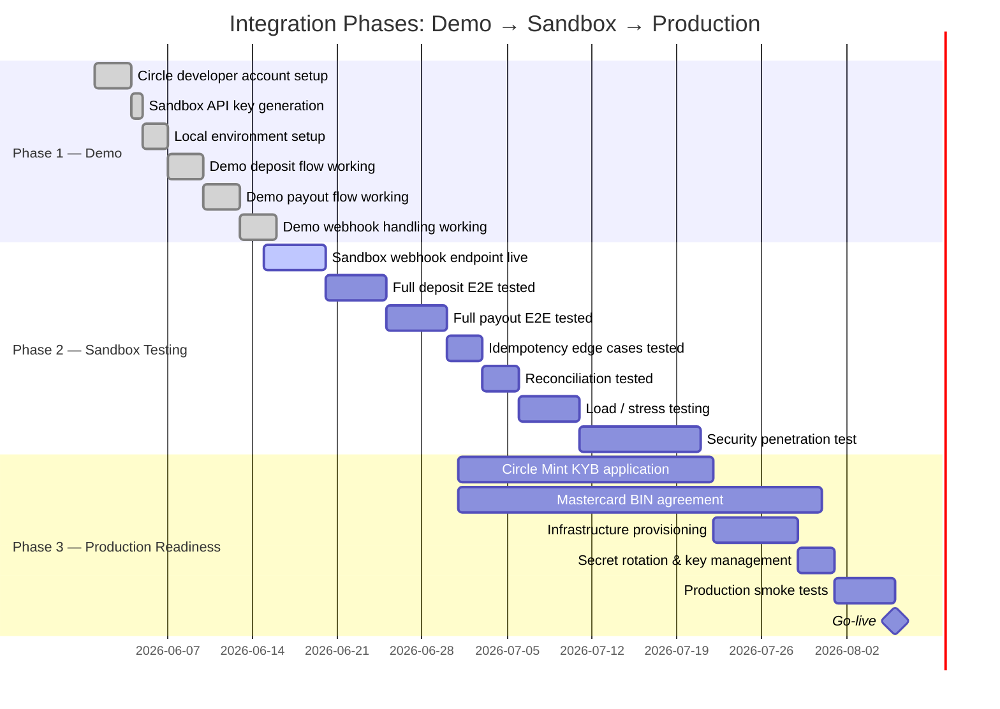
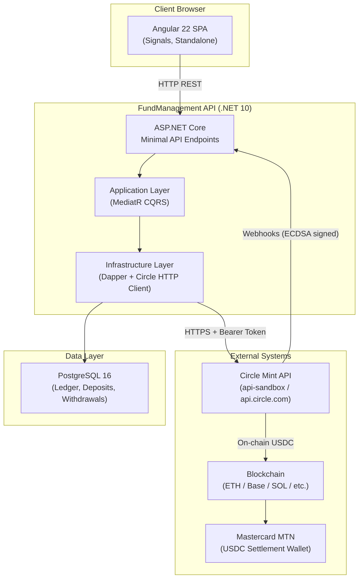
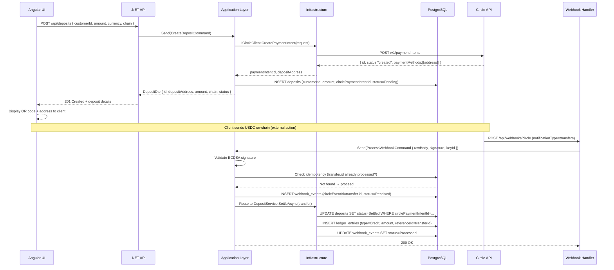
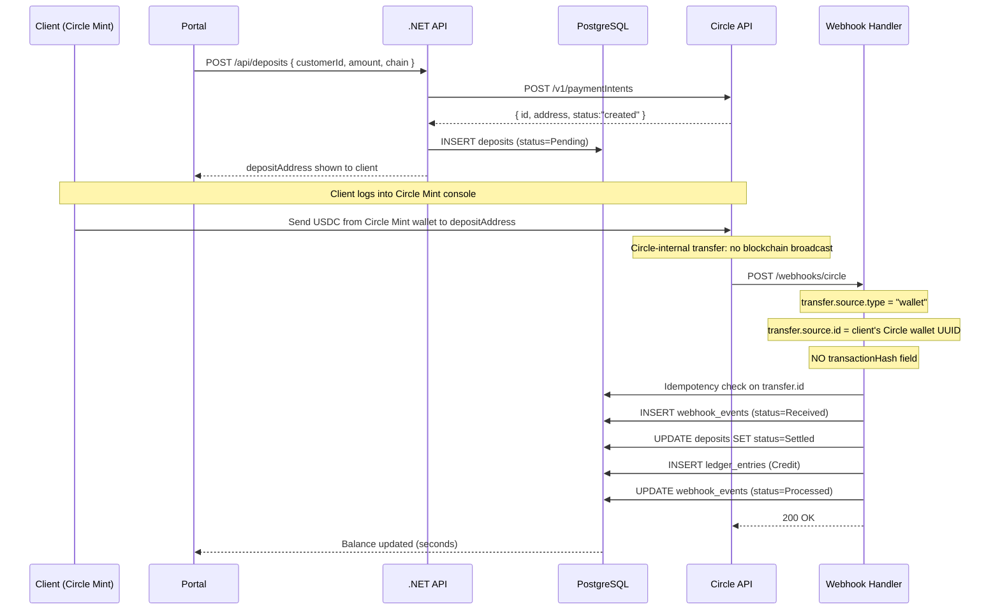
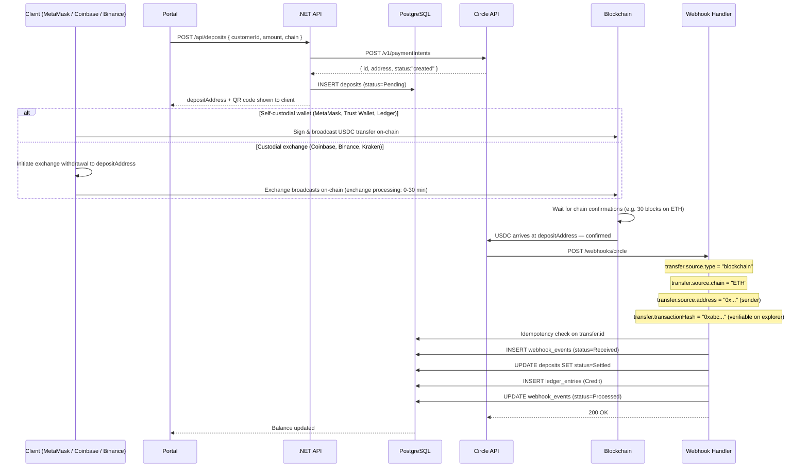
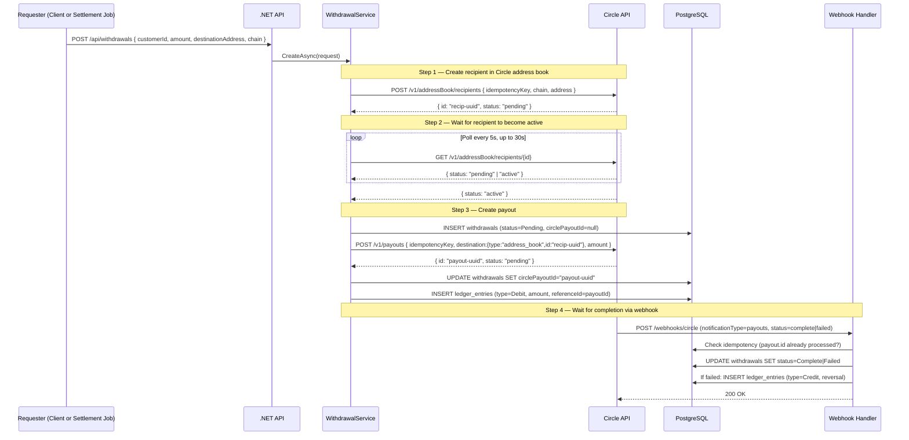
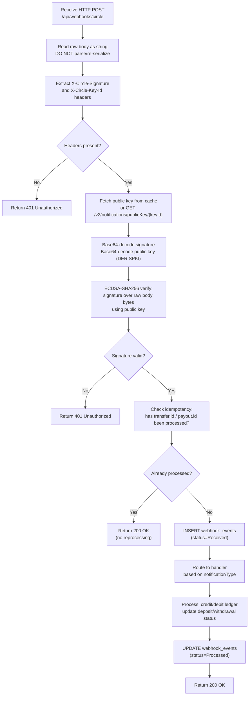
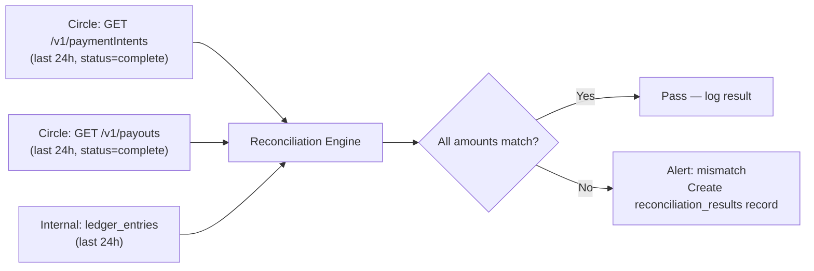

# Circle USDC Integration — Complete Knowledge Base
## Fintech / Payment Processing / BIN Sponsor

| Field | Value |
|---|---|
| Version | 1.1 — Added dual client funding scenarios |
| Date | 2026-06-06 |
| Status | Reference Document |
| Audience | Management Team · Technical Team |
| Classification | Internal — Confidential |

---

## Table of Contents

**Part 1 — Management Brief**
1. [Executive Summary](#1-executive-summary)
2. [Business Model & Value Proposition](#2-business-model--value-proposition)
3. [Key Stakeholders & Roles](#3-key-stakeholders--roles)
4. [End-to-End Business Flow (Plain Language)](#4-end-to-end-business-flow-plain-language)
5. [Mastercard USDC Settlement Explained](#5-mastercard-usdc-settlement-explained)
6. [Risk, Compliance & Regulatory Overview](#6-risk-compliance--regulatory-overview)
7. [Go-to-Market Phases](#7-go-to-market-phases)
8. [Fee Structure & Financial Model](#8-fee-structure--financial-model)

**Part 2 — Technical Reference**
9. [System Architecture](#9-system-architecture)
10. [Environment Guide: Demo → Sandbox → Production](#10-environment-guide-demo--sandbox--production)
11. [Circle Mint Account Setup](#11-circle-mint-account-setup)
12. [Deposit Flow — Funding a Client Account](#12-deposit-flow--funding-a-client-account)
13. [Withdrawal / Payout Flow](#13-withdrawal--payout-flow)
14. [Mastercard USDC Settlement Flow — Technical](#14-mastercard-usdc-settlement-flow--technical)
15. [Webhook Integration](#15-webhook-integration)
16. [Idempotency & Duplicate Protection](#16-idempotency--duplicate-protection)
17. [Security Architecture](#17-security-architecture)
18. [Database Schema](#18-database-schema)
19. [API Reference (Complete)](#19-api-reference-complete)
20. [Error Codes & Handling](#20-error-codes--handling)
21. [Reconciliation](#21-reconciliation)
22. [Sandbox Testing Guide](#22-sandbox-testing-guide)
23. [Production Deployment Checklist](#23-production-deployment-checklist)
24. [Monitoring & Alerting](#24-monitoring--alerting)
25. [Troubleshooting Runbook](#25-troubleshooting-runbook)

---

# PART 1 — MANAGEMENT BRIEF

---

## 1. Executive Summary

Your company operates as a **BIN Sponsor** — a licensed financial institution that holds a BIN (Bank Identification Number) range issued by Mastercard. This allows you to issue prepaid/debit cards to clients under your sponsorship.

You hold a **Circle Mint Account**, which is a business-grade USDC account operated by Circle Financial. Circle Mint gives you direct, fee-free conversion between USD and USDC, plus a full API to receive and send USDC on multiple blockchains.

**The core business flow:**

1. **Clients deposit funds** into their FundManagement accounts via one of two methods:
   - **Scenario 1 — Circle Mint clients**: Client sends USDC from their own Circle Mint business account directly to a Circle-generated deposit address. Transfer is Circle-internal — no blockchain, no gas, settles in seconds.
   - **Scenario 2 — External wallet/exchange clients**: Client sends USDC on-chain from MetaMask, Coinbase, Binance, Kraken, or any external wallet. Transfer travels on the blockchain (ETH, Base, SOL, etc.), settles in seconds to minutes.
2. Those funds are tracked in your internal ledger and credited to the client's account (same logic for both scenarios)
3. Clients use Mastercard cards (issued under your BIN) to spend those funds
4. When a card transaction settles, you pay Mastercard directly in USDC via Circle's Crypto Payouts API — settling to Mastercard's USDC settlement account

This architecture eliminates traditional wire transfers and correspondent banking for settlement, replaces them with USDC on-chain, and provides near-real-time settlement versus the T+2/T+3 of traditional card settlement.

---

## 2. Business Model & Value Proposition

### What Problem This Solves

| Traditional Card Settlement | This Architecture |
|---|---|
| T+2 to T+3 settlement | Near real-time (minutes to hours) |
| Wire transfer fees + FX | USDC transfer — minimal gas fees |
| Correspondent bank dependencies | Direct Circle → Mastercard MTN |
| USD fiat rails with banking hours | 24/7/365 blockchain rails |
| Complex reconciliation | On-chain truth + internal ledger |

### Who This Serves

- **Clients**: Businesses or individuals who want to load USDC and spend via card globally
- **Your Company**: Revenue from float, FX spread, transaction fees, card issuance fees
- **Mastercard**: Gains USDC settlement volume through their Multi-Token Network (MTN)

### Circle Mint's Role

Circle Mint is not a bank — it is Circle's institutional product that lets verified businesses:
- Convert USD → USDC at 1:1 (no fee)
- Convert USDC → USD at 1:1 (no fee)
- Send USDC to any blockchain address globally
- Receive USDC from any blockchain address
- Manage a business-grade USDC treasury

---

## 3. Key Stakeholders & Roles



| Stakeholder | Role | Responsibility |
|---|---|---|
| Your Company | BIN Sponsor, FundManagement operator | Issue cards, run platform, manage Circle Mint account |
| Circle Financial | USDC infrastructure | Process deposits/payouts, fire webhooks, hold USDC treasury |
| Mastercard | Card network | Clear card transactions, receive USDC settlement via MTN |
| Client — Type 1 (Circle Mint) | Cardholder with Circle Mint account | Funds account via Circle-internal transfer; no blockchain needed |
| Client — Type 2 (External wallet/exchange) | Cardholder using MetaMask, Coinbase, Binance, etc. | Funds account via on-chain USDC transfer |
| Your Bank | Banking partner | USD/USDC conversion (if using Circle Mint fiat rails) |

---

## 4. End-to-End Business Flow (Plain Language)

### Client Funding — Two Scenarios

Clients fund their FundManagement account using one of two methods, depending on where their USDC is held. **The deposit address and Payment Intent are generated the same way in both cases — only how the client sends USDC differs.**

| | Scenario 1 | Scenario 2 |
|---|---|---|
| **Client wallet type** | Circle Mint business account | External crypto wallet or exchange |
| **Examples** | Circle Mint console, Circle API | MetaMask, Coinbase, Binance, Kraken, Trust Wallet, hardware wallet |
| **Transfer path** | Circle-internal (wallet-to-wallet within Circle) | On-chain blockchain transaction |
| **Webhook source.type** | `"wallet"` | `"blockchain"` |
| **Settlement speed** | Seconds (no chain confirmation needed) | Minutes (depends on chain + congestion) |
| **Gas fee** | None | Client pays gas from their wallet |
| **Transaction hash** | Not present | Present (`transactionHash`) |

---

### Flow A-1 — Client Funds Account via Circle Mint Account

```
Step 1:  Client logs into FundManagement portal
Step 2:  Client clicks "Add Funds" → selects "Circle Mint" as source, enters amount, selects chain
Step 3:  System creates a Circle Payment Intent → unique deposit address generated
Step 4:  Portal shows the deposit address and amount to send
Step 5:  Client opens their Circle Mint console (or Circle API)
Step 6:  Client sends USDC from their Circle Mint wallet to the deposit address
Step 7:  Circle processes transfer internally — no blockchain hop
Step 8:  Circle fires webhook: notificationType=transfers, transfer.source.type="wallet"
Step 9:  Your system detects wallet source, validates signature, checks idempotency
Step 10: Your system credits the client's ledger (LedgerEntry = Credit)
Step 11: Deposit marked Settled; client sees updated balance in seconds
```

### Flow A-2 — Client Funds Account via External Wallet or Exchange

```
Step 1:  Client logs into FundManagement portal
Step 2:  Client clicks "Add Funds" → selects chain (ETH / Base / SOL / etc.), enters amount
Step 3:  System creates a Circle Payment Intent → unique deposit address generated for that chain
Step 4:  Portal shows deposit address + QR code
         — — —
Step 5a  IF client uses a self-custodial wallet (MetaMask, Trust Wallet, Ledger, Phantom):
         Client opens wallet app → pastes deposit address → sends USDC → signs transaction on-device
         — — —
Step 5b  IF client uses a custodial exchange (Coinbase, Binance, Kraken):
         Client logs into exchange → Withdraw/Send → USDC → enters deposit address → confirms withdrawal
         (Exchange may have its own processing time before broadcast: 0–30 min)
         — — —
Step 6:  USDC broadcast on-chain (ETH ~12s block time; Base/SOL <2s; Polygon ~2s)
Step 7:  Circle waits for required confirmations (chain-dependent: see section 12)
Step 8:  Circle fires webhook: notificationType=transfers, transfer.source.type="blockchain"
Step 9:  Your system detects blockchain source, validates signature, checks idempotency
Step 10: Your system credits the client's ledger (LedgerEntry = Credit)
Step 11: Deposit marked Settled; client sees updated balance
```

### Flow B — Client Spends via Mastercard Card

```
Step 1: Client uses their Mastercard card at a merchant (online or POS)
Step 2: Transaction hits Mastercard's network
Step 3: Mastercard routes authorization request to your BIN Sponsor system
Step 4: Your system checks client's available balance → approves or declines
Step 5: Transaction is approved — client's balance is reserved
Step 6: At end-of-day/batch: Mastercard sends settlement file to BIN Sponsor
Step 7: Your system debits the client's ledger for each settled transaction
```

### Flow C — Settlement to Mastercard (Your BIN Sponsor Obligation)

```
Step 1: Mastercard sends daily settlement amount owed by your BIN (net of all card transactions)
Step 2: Your system creates a Circle Payout to Mastercard's USDC settlement address
Step 3: Circle routes the USDC on-chain to Mastercard's Multi-Token Network wallet
Step 4: Mastercard confirms receipt — settlement is complete
Step 5: Reconciliation: your internal ledger matches Circle payout amount
```

### High-Level End-to-End Flow Diagram



---

## 5. Mastercard USDC Settlement Explained

### What is Mastercard MTN?

Mastercard's **Multi-Token Network (MTN)** is Mastercard's blockchain-based settlement infrastructure. It allows institutions to settle card transactions in USDC rather than USD wire transfers.

**Why this matters:**
- No correspondent banking delays
- 24/7 settlement (vs. banking hours)
- Lower cost than SWIFT/wire
- Full on-chain auditability

### How Your BIN Sponsor Obligation Works

As a BIN Sponsor, every card transaction made by your clients creates a **net settlement obligation** to Mastercard. Traditionally this is a USD wire. With MTN:

1. Mastercard provides a USDC wallet address (their MTN settlement address)
2. You register that address in Circle as a recipient
3. Each settlement cycle: you send USDC via Circle Payout to that address
4. Mastercard's system marks your BIN's settlement as complete

> **Important**: The Mastercard MTN address is provided directly by Mastercard during your BIN Sponsor agreement setup. It must be registered with Mastercard's compliance team and verified before first use. This address is registered once in Circle's address book and reused for all settlement payouts.

---

## 6. Risk, Compliance & Regulatory Overview

### Regulatory Requirements

| Requirement | Owner | Notes |
|---|---|---|
| KYB (Know Your Business) | Circle | Required for Circle Mint account approval |
| KYC (Know Your Customer) | Your Company | Required for each client onboarding |
| AML/CFT Monitoring | Your Company | Transaction screening, suspicious activity reports |
| BIN License | Mastercard | Requires banking sponsor in your jurisdiction |
| Payment Institution License | Your Company or Banking Sponsor | Jurisdiction-specific |
| USDC Custodial Rules | Circle | Circle holds USDC in reserve — 1:1 backed |

### Key Risks

| Risk | Mitigation |
|---|---|
| USDC price deviation from USD | USDC is maintained 1:1 by Circle — redeemable at any time |
| Blockchain congestion delays settlement | Choose fast/cheap chains (Base, Polygon, Solana) for settlement |
| Circle downtime | Monitor Circle status page; implement retry with exponential backoff |
| Webhook delivery failure | Webhook idempotency + reconciliation polling job as fallback |
| Card authorization without sufficient balance | Real-time balance check before authorization approval |
| Double credit (duplicate webhook) | `transfer.id` idempotency key — stored before processing |

### Compliance Checklist for Go-Live

- [ ] Circle Mint KYB approved
- [ ] Legal entity established in jurisdiction
- [ ] Mastercard BIN Sponsor agreement signed
- [ ] AML policy documented and active
- [ ] KYC process for client onboarding operational
- [ ] OFAC/sanctions screening on withdrawal addresses
- [ ] SOC 2 / ISO 27001 security posture (or equivalent)
- [ ] Incident response plan documented
- [ ] Data protection / GDPR compliance (if EU clients)

---

## 7. Go-to-Market Phases



### Phase 1 — Demo Environment

**Goal**: Prove the integration works end-to-end on local machines with fake USDC.

- Uses Circle sandbox API (`api-sandbox.circle.com`)
- API key prefix: `SAND_API_KEY_`
- No real money involved
- Webhook testing via `ngrok` or `webhook.site`
- Duration: 1-2 weeks

**Deliverable**: Working demo showing deposit, ledger credit, withdrawal, and webhook handling.

### Phase 2 — Sandbox Testing

**Goal**: Validate all edge cases, load, and security in a production-like environment.

- Same Circle sandbox API but deployed to a staging server
- Public HTTPS endpoint for webhooks
- Automated regression tests
- Penetration testing
- Duration: 4-6 weeks

**Deliverable**: Signed-off test report covering all scenarios in section 22.

### Phase 3 — Production

**Goal**: Go live with real clients and real USDC.

- Circle Mint KYB approved (3-4 week process typically)
- Mastercard BIN agreement in place
- Production API key: `LIVE_API_KEY_`
- Production base URL: `https://api.circle.com`
- HSM or secrets manager for API keys
- 24/7 monitoring active

**Deliverable**: Operational production system processing real transactions.

---

## 8. Fee Structure & Financial Model

### Circle Fees

| Activity | Fee |
|---|---|
| USD → USDC conversion | **Free** (Circle Mint benefit) |
| USDC → USD conversion | **Free** (Circle Mint benefit) |
| Receiving USDC (deposits) | **Free** |
| Sending USDC (payouts) | Gas fee passed through (varies by chain) |
| Circle Mint account | Application-based; typically free for qualified businesses |

### Blockchain Gas Fees (Approximate, Production)

| Chain | Avg Transfer Cost (USDC) | Settlement Time |
|---|---|---|
| Ethereum (ETH) | $2–$20 | 5–15 min |
| Polygon (POLY) | <$0.01 | 2–5 min |
| Base (BASE) | <$0.01 | 2–5 min |
| Solana (SOL) | <$0.01 | 30 sec |
| Arbitrum (ARB) | <$0.05 | 2–5 min |

> **Recommendation**: Use Base or Solana for settlement payouts to Mastercard MTN to minimize cost and maximize speed.

### Your Revenue Streams

| Stream | Mechanism |
|---|---|
| Card interchange | % of each card transaction (Mastercard interchange) |
| FX spread | If clients deposit non-USD stablecoins and you convert |
| Float income | USD yield on USDC held in Circle Mint (T-bill backed) |
| Card issuance fee | One-time or annual fee per card issued |
| Transaction fee | Small fee per deposit/withdrawal |

---

---

# PART 2 — TECHNICAL REFERENCE

---

## 9. System Architecture

### Layer Diagram



### Clean Architecture Rules

```
Domain Layer        → Zero external dependencies. Entities only.
Application Layer   → MediatR commands/queries/handlers. Interfaces.
Infrastructure Layer → Implements interfaces. Dapper SQL. Circle HTTP calls.
API Layer           → Minimal API endpoints. Dispatches to MediatR only.
```

**Hard rule**: Business logic never lives in the API layer. Every endpoint does exactly one thing: dispatch to MediatR.

### Component Responsibility Map

| Component | Responsibility |
|---|---|
| `WebhooksController` | Receive + validate Circle webhook; dispatch to `ProcessWebhookCommand` |
| `WebhookService` | Idempotency check; route to `DepositService` or `WithdrawalService` |
| `DepositService` | Create Payment Intent; settle deposit on webhook |
| `WithdrawalService` | Create recipient; poll for active; create payout |
| `LedgerService` | Create ledger entries only — single source of truth for balances |
| `CircleClient` | All HTTP calls to Circle API; typed request/response |
| `ReconciliationService` | Compare Circle transactions vs internal ledger |

---

## 10. Environment Guide: Demo → Sandbox → Production

### Environment Comparison

| Property | Demo (Local) | Sandbox (Staging) | Production |
|---|---|---|---|
| Circle Base URL | `https://api-sandbox.circle.com` | `https://api-sandbox.circle.com` | `https://api.circle.com` |
| API Key Prefix | `SAND_API_KEY_` | `SAND_API_KEY_` | `LIVE_API_KEY_` |
| Real Money | No | No | Yes |
| Webhook Endpoint | ngrok tunnel | Public HTTPS server | Production HTTPS server |
| Blockchain | Testnet (fake USDC) | Testnet | Mainnet |
| Circle Console | `app.circle.com` (sandbox mode) | `app.circle.com` (sandbox mode) | `app.circle.com` (production mode) |
| USDC | Circle test USDC — no value | Circle test USDC — no value | Real USDC — real value |

### How to Get API Keys

**Sandbox key:**
1. Sign up at https://console.circle.com
2. Create a developer account
3. Navigate to API Keys → Create Key
4. Key will have prefix `SAND_API_KEY_`
5. Store in `appsettings.Development.json` (gitignored)

**Production key:**
1. Log in to https://console.circle.com
2. Click "Access Mainnet" → start KYB application
3. After KYB approval, navigate to API Keys → Create Production Key
4. Key will have prefix `LIVE_API_KEY_`
5. Store in Azure Key Vault / AWS Secrets Manager — never in code or config files

### Configuration

```json
// appsettings.json (committed — placeholder only)
{
  "Circle": {
    "ApiKey": "SAND_API_KEY_HERE",
    "BaseUrl": "https://api-sandbox.circle.com"
  }
}

// appsettings.Development.json (gitignored — real sandbox key)
{
  "Circle": {
    "ApiKey": "SAND_API_KEY_XXXXXXXXXXXX",
    "BaseUrl": "https://api-sandbox.circle.com"
  }
}

// Production (via secrets manager — never in file)
// Circle:ApiKey = LIVE_API_KEY_XXXXXXXXXXXX
// Circle:BaseUrl = https://api.circle.com
```

---

## 11. Circle Mint Account Setup

### Step 1 — Developer Console Account

1. Go to https://console.circle.com
2. Create account with business email
3. Verify email
4. This gives you sandbox access immediately — no approval needed

### Step 2 — KYB Application (Production Only)

Circle Mint requires KYB (Know Your Business) before you can access production and real USDC.

**Required documents typically include:**
- Certificate of Incorporation
- Articles of Association
- Proof of registered address
- Directors list + ID documents (passport/government ID)
- UBO (Ultimate Beneficial Owner) disclosure — anyone owning >25%
- AML/KYC policy document
- Banking references
- Business description + intended use case

**Timeline**: 2–4 weeks depending on jurisdiction and document completeness.

**Process:**
1. Log into console.circle.com
2. Click "Access Mainnet" in the dashboard
3. Complete the onboarding form
4. Upload all required documents
5. Circle compliance review
6. Approval notification via email
7. Production API key issued

### Step 3 — Webhook Subscription

Once account is active, register your webhook endpoint:

```bash
# Register webhook subscription
curl -X POST https://api-sandbox.circle.com/v1/notifications/subscriptions \
  -H "Authorization: Bearer SAND_API_KEY_XXXX" \
  -H "Content-Type: application/json" \
  -d '{
    "endpoint": "https://your-server.com/api/webhooks/circle"
  }'
```

**Response:**
```json
{
  "data": {
    "id": "sub-uuid",
    "endpoint": "https://your-server.com/api/webhooks/circle",
    "subscriptionDetails": [
      { "url": "https://your-server.com/api/webhooks/circle", "status": "pending" }
    ]
  }
}
```

Circle will send a test notification to verify the endpoint is reachable.

### Step 4 — Verify Connectivity

```bash
curl https://api-sandbox.circle.com/ping
# Expected: {"message": "pong"}

curl https://api-sandbox.circle.com/v1/configuration \
  -H "Authorization: Bearer SAND_API_KEY_XXXX"
# Returns: your account configuration

curl https://api-sandbox.circle.com/v1/businessAccount/balances \
  -H "Authorization: Bearer SAND_API_KEY_XXXX"
# Returns: current USDC and other stablecoin balances
```

---

## 12. Deposit Flow — Funding a Client Account

### Scenario Comparison

| Property | Scenario 1: Circle Mint Client | Scenario 2: External Wallet / Exchange |
|---|---|---|
| Client action | Send from Circle Mint console or API | Sign on-chain tx (MetaMask) or exchange withdrawal |
| Transfer path | Circle internal (no blockchain) | Blockchain on-chain |
| Webhook `transfer.source.type` | `"wallet"` | `"blockchain"` |
| Webhook `transfer.source.id` | Circle wallet UUID of sender | N/A |
| Webhook `transfer.source.chain` | Not present | `"ETH"` / `"BASE"` / `"SOL"` etc. |
| Webhook `transfer.source.address` | Not present | Sender's blockchain address |
| Webhook `transfer.transactionHash` | Not present | On-chain tx hash |
| Confirmation wait | None — instant | Chain-dependent (see table below) |
| Gas fee borne by | Neither party | Client (deducted from their wallet) |
| `paymentIntentId` on webhook | Present (Circle-internal) | Present if Circle links it; may be absent |
| Fallback if webhook fails | Poll `GET /v1/paymentIntents/{id}` | Same — poll payment intent status |

### Blockchain Confirmation Requirements (Scenario 2)

| Chain | Required Confirmations | Approx Wait |
|---|---|---|
| Ethereum (ETH) | 30 | ~6 min |
| Base (BASE) | 10 | ~20 sec |
| Solana (SOL) | 32 | ~15 sec |
| Polygon (POLY) | 200 | ~4 min |
| Arbitrum (ARB) | 10 | ~20 sec |
| Optimism (OP) | 10 | ~20 sec |
| Avalanche (AVAX) | 20 | ~1 min |

> Verify current confirmation counts in Circle docs — they change with network upgrades.

### Full Technical Flow



### Scenario 1 — Circle Mint Client: Detailed Sequence



### Scenario 2 — External Wallet / Exchange: Detailed Sequence



### Step-by-Step API Calls

#### Step 1 — Create Payment Intent

```http
POST https://api-sandbox.circle.com/v1/paymentIntents
Authorization: Bearer SAND_API_KEY_XXXX
Content-Type: application/json

{
  "idempotencyKey": "550e8400-e29b-41d4-a716-446655440000",
  "amount": {
    "amount": "100.00",
    "currency": "USD"
  },
  "settlementCurrency": "USD",
  "paymentMethods": [
    {
      "type": "blockchain",
      "chain": "ETH"
    }
  ]
}
```

**Response (201):**
```json
{
  "data": {
    "id": "fc988ed5-c129-4f70-a064-e5beb7eb8e32",
    "amount": { "amount": "100.00", "currency": "USD" },
    "amountPaid": { "amount": "0.00", "currency": "USD" },
    "amountRefunded": { "amount": "0.00", "currency": "USD" },
    "settlementCurrency": "USD",
    "paymentMethods": [
      {
        "type": "blockchain",
        "chain": "ETH",
        "address": "0x618ceea8c0d120f642a4c63f74e7e0c9c7e7b00d"
      }
    ],
    "fees": [],
    "paymentIds": [],
    "timeline": [
      { "status": "created", "time": "2026-06-06T10:00:00Z" }
    ],
    "createDate": "2026-06-06T10:00:00Z",
    "updateDate": "2026-06-06T10:00:00Z",
    "expiresOn": "2026-06-07T10:00:00Z",
    "status": "created"
  }
}
```

**Key fields:**
- `id` → your `circlePaymentIntentId` — store this
- `paymentMethods[0].address` → the blockchain address to show the client
- `status` → `created | pending | complete | expired | failed`

#### Step 2 — Poll Payment Intent Status (optional, fallback)

```http
GET https://api-sandbox.circle.com/v1/paymentIntents/{id}
Authorization: Bearer SAND_API_KEY_XXXX
```

Use this as a fallback if webhook delivery fails. Your reconciliation job polls all `Pending` deposits hourly.

#### Step 3 — Receive Webhook (Inbound Transfer)

Circle fires this when the on-chain transfer is detected:

```json
{
  "clientId": "c60d2d5b-203c-45bb-9f6e-93641d40a599",
  "notificationType": "transfers",
  "transfer": {
    "id": "b8f9ee11-0ee9-4c5c-a3f4-ec7c4dd5e7e2",
    "source": {
      "type": "blockchain",
      "chain": "ETH",
      "address": "0xabc123..."
    },
    "destination": {
      "type": "wallet",
      "id": "your-circle-wallet-id"
    },
    "amount": { "amount": "100.00", "currency": "USD" },
    "status": "complete",
    "transactionHash": "0x123abc...",
    "paymentIntentId": "fc988ed5-c129-4f70-a064-e5beb7eb8e32"
  }
}
```

**Scenario 1 — Circle Mint client webhook payload:**
```json
{
  "clientId": "c60d2d5b-203c-45bb-9f6e-93641d40a599",
  "notificationType": "transfers",
  "transfer": {
    "id": "b8f9ee11-0ee9-4c5c-a3f4-ec7c4dd5e7e2",
    "source": {
      "type": "wallet",
      "id": "client-circle-wallet-uuid"
    },
    "destination": {
      "type": "wallet",
      "id": "your-circle-wallet-id"
    },
    "amount": { "amount": "100.00", "currency": "USD" },
    "status": "complete",
    "paymentIntentId": "fc988ed5-c129-4f70-a064-e5beb7eb8e32"
  }
}
```
Note: **no** `transactionHash` field — this is a Circle-internal transfer.

**Scenario 2 — External wallet/exchange webhook payload:**
```json
{
  "clientId": "c60d2d5b-203c-45bb-9f6e-93641d40a599",
  "notificationType": "transfers",
  "transfer": {
    "id": "b8f9ee11-0ee9-4c5c-a3f4-ec7c4dd5e7e2",
    "source": {
      "type": "blockchain",
      "chain": "ETH",
      "address": "0xabc123..."
    },
    "destination": {
      "type": "wallet",
      "id": "your-circle-wallet-id"
    },
    "amount": { "amount": "100.00", "currency": "USD" },
    "status": "complete",
    "transactionHash": "0x123abc...",
    "paymentIntentId": "fc988ed5-c129-4f70-a064-e5beb7eb8e32"
  }
}
```

**Critical fields (both scenarios):**
- `transfer.id` → idempotency key — store before processing
- `transfer.status` → `complete` = credit; `failed` = mark deposit failed
- `transfer.source.type` → `"wallet"` = Circle Mint client; `"blockchain"` = external
- `transfer.paymentIntentId` → links transfer to your internal deposit record
- `transfer.transactionHash` → present only in Scenario 2; use for on-chain audit trail
- `transfer.source.address` → present only in Scenario 2; sender's blockchain address (useful for AML screening)

> **Gap**: `paymentIntentId` may be absent (more likely in Scenario 2 edge cases). If absent, you need a fallback — see section 25 (Troubleshooting).

**Source type detection in handler:**
```csharp
private async Task HandleTransferAsync(TransferPayload transfer)
{
    if (transfer.Source.Type == "wallet")
    {
        // Scenario 1: Circle Mint client — instant, no tx hash
        // Log source wallet ID for audit; settle immediately
        _logger.LogInformation("Deposit from Circle Mint wallet {WalletId}", transfer.Source.Id);
    }
    else if (transfer.Source.Type == "blockchain")
    {
        // Scenario 2: External wallet/exchange — has tx hash for verification
        _logger.LogInformation(
            "Deposit from {Chain} address {Address}, txHash {TxHash}",
            transfer.Source.Chain, transfer.Source.Address, transfer.TransactionHash);
        // Optionally: screen transfer.Source.Address against OFAC/AML
        await _complianceService.ScreenAddressAsync(transfer.Source.Address, transfer.Source.Chain);
    }

    // Settlement logic is IDENTICAL for both scenarios
    await SettleDepositAsync(transfer);
}
```

#### Step 4 — Create Ledger Entry

After confirming webhook is genuine and `transfer.status == "complete"`:

```sql
-- Atomic transaction
BEGIN;
  INSERT INTO webhook_events (id, circle_event_id, event_type, payload, status)
  VALUES (gen_random_uuid(), 'b8f9ee11...', 'transfers', '...json...', 'Received');

  UPDATE deposits
  SET status = 'Settled'
  WHERE circle_payment_intent_id = 'fc988ed5...';

  INSERT INTO ledger_entries (id, funding_account_id, entry_type, amount, reference_id)
  VALUES (gen_random_uuid(), <fundingAccountId>, 'Credit', 100.00, 'b8f9ee11...');

  UPDATE webhook_events
  SET status = 'Processed'
  WHERE circle_event_id = 'b8f9ee11...';
COMMIT;
```

### Supported Chains for Deposits

| Chain Code | Chain | Notes |
|---|---|---|
| `ETH` | Ethereum | Widely supported, slower/costly |
| `BASE` | Base | Recommended — fast, cheap, Coinbase-backed |
| `SOL` | Solana | Fastest, cheapest |
| `POLY` | Polygon | Low cost |
| `ARB` | Arbitrum | L2, low cost |
| `OP` | Optimism | L2, low cost |
| `AVAX` | Avalanche | Fast |
| `ALGO` | Algorand | |
| `XLM` | Stellar | |
| `NEAR` | NEAR Protocol | |
| `NOBLE` | Noble (Cosmos) | |
| `HBAR` | Hedera | |
| `UNICHAIN` | Unichain | |
| `WORLDCHAIN` | World Chain | |

---

## 13. Withdrawal / Payout Flow

This covers two scenarios:
- **Client withdrawal**: Client requests their funds back to their wallet
- **Mastercard settlement**: Your company settles card transactions with Mastercard

The technical flow is identical — only the recipient address differs.

### Full Technical Flow



### Step-by-Step API Calls

#### Step 1 — Create Address Book Recipient

```http
POST https://api-sandbox.circle.com/v1/addressBook/recipients
Authorization: Bearer SAND_API_KEY_XXXX
Content-Type: application/json

{
  "idempotencyKey": "a4e8b3c1-5d6e-7f8a-9b0c-1d2e3f4a5b6c",
  "chain": "ETH",
  "address": "0xDestinationAddress...",
  "nickname": "Client-001-ETH"
}
```

**Response (201):**
```json
{
  "data": {
    "id": "recipient-uuid-123",
    "chain": "ETH",
    "address": "0xDestinationAddress...",
    "status": "pending",
    "createDate": "2026-06-06T10:00:00Z"
  }
}
```

Poll `GET /v1/addressBook/recipients/{id}` until `status == "active"`.

**Or** subscribe to `addressBookRecipients` webhook for async notification.

#### Step 2 — Poll Recipient Status

```http
GET https://api-sandbox.circle.com/v1/addressBook/recipients/{recipientId}
Authorization: Bearer SAND_API_KEY_XXXX
```

```json
{ "data": { "id": "...", "status": "active" } }
```

#### Step 3 — Create Payout

```http
POST https://api-sandbox.circle.com/v1/payouts
Authorization: Bearer SAND_API_KEY_XXXX
Content-Type: application/json

{
  "idempotencyKey": "b5f9c4d2-6e7f-8a9b-0c1d-2e3f4a5b6c7d",
  "destination": {
    "type": "address_book",
    "id": "recipient-uuid-123"
  },
  "amount": {
    "amount": "100.00",
    "currency": "USD"
  }
}
```

**Response (201):**
```json
{
  "data": {
    "id": "payout-uuid-456",
    "destination": { "type": "address_book", "id": "recipient-uuid-123" },
    "amount": { "amount": "100.00", "currency": "USD" },
    "status": "pending",
    "createDate": "2026-06-06T10:00:00Z"
  }
}
```

#### Step 4 — Payout Completion Webhook

```json
{
  "clientId": "c60d2d5b-203c-45bb-9f6e-93641d40a599",
  "notificationType": "payouts",
  "payout": {
    "id": "payout-uuid-456",
    "status": "complete",
    "amount": { "amount": "100.00", "currency": "USD" }
  }
}
```

Failed payout webhook:
```json
{
  "clientId": "...",
  "notificationType": "payouts",
  "payout": {
    "id": "payout-uuid-456",
    "status": "failed",
    "errorCode": "insufficient_funds"
  }
}
```

**On failure**: create a reversal credit ledger entry to restore the client's balance.

### Payout Error Codes

| Error Code | Meaning | Action |
|---|---|---|
| `insufficient_funds` | Circle business wallet has insufficient USDC | Top up Circle Mint account; retry |
| `transaction_denied` | Compliance or risk block | Contact Circle support; investigate destination address |
| `transaction_failed` | On-chain failure | Retry with new idempotency key |
| `transaction_returned` | USDC returned by destination | Investigate; re-credit client |

### Supported Chains for Payouts

`ALGO ARB AVAX BASE ETH HBAR NEAR NOBLE OP POLY SOL XLM`

---

## 14. Mastercard USDC Settlement Flow — Technical

### Overview

This is a scheduled batch operation, typically run once per day after Mastercard delivers the settlement file.

### Prerequisites

1. **Mastercard MTN wallet address**: Provided by Mastercard during BIN Sponsor agreement. Treat as a constant in your configuration — never hardcode in source.
2. **Settlement schedule**: Agreed with Mastercard — typically 10:00 UTC daily.
3. **Circle business wallet must have sufficient USDC**: Monitor daily.

### Configuration

```json
// appsettings.json
{
  "Mastercard": {
    "SettlementAddress": "MASTERCARD_USDC_ADDRESS_HERE",
    "SettlementChain": "BASE",
    "SettlementSchedule": "0 10 * * *"
  }
}
```

### Settlement Job Flow

```csharp
// Pseudocode — SettlementJob.cs
public async Task RunAsync(DateTime settlementDate)
{
    // 1. Parse Mastercard settlement file for the settlement date
    var netAmount = ParseSettlementFile(settlementDate);

    // 2. Verify Circle business wallet balance
    var balance = await _circleClient.GetBusinessBalanceAsync();
    if (balance.Usdc < netAmount)
        throw new InsufficientCircleBalanceException(netAmount, balance.Usdc);

    // 3. Ensure Mastercard recipient exists and is active
    var recipient = await EnsureMastercardRecipientAsync();

    // 4. Create withdrawal record
    var withdrawal = await CreateSettlementWithdrawalAsync(netAmount, settlementDate);

    // 5. Submit payout to Circle
    var payout = await _circleClient.CreatePayoutAsync(new CreatePayoutRequest
    {
        IdempotencyKey = DeriveSettlementIdempotencyKey(settlementDate),
        Destination = new AddressBookDestination { Id = recipient.Id },
        Amount = new MoneyAmount { Amount = netAmount.ToString("F2"), Currency = "USD" }
    });

    // 6. Update withdrawal with Circle payout ID
    await UpdateWithdrawalPayoutIdAsync(withdrawal.Id, payout.Id);

    // 7. Completion handled by payout webhook
}

private string DeriveSettlementIdempotencyKey(DateTime date)
    => $"mastercard-settlement-{date:yyyy-MM-dd}";
```

### Settlement Reconciliation

After each settlement cycle, compare:
1. Mastercard settlement file total
2. Sum of ledger debits for card transactions in that period
3. Circle payout amount
4. On-chain transfer amount (verify via blockchain explorer)

All four must match within tolerance (e.g. ±$0.01 for rounding).

---

## 15. Webhook Integration

### Overview

Circle sends signed HTTP POST notifications to your registered endpoint when payment intents, transfers, payouts, or recipients change status.

**Critical**: Circle Mint uses **ECDSA_SHA_256** asymmetric signatures — NOT HMAC. Do not implement HMAC validation.

### Webhook Headers

Every Circle webhook includes:
```
X-Circle-Signature: <base64-encoded ECDSA signature>
X-Circle-Key-Id:    <UUID of the signing public key>
Content-Type:       application/json
```

### Validation Algorithm



### Signature Validation Code

```csharp
// WebhookService.ValidateSignatureAsync
private async Task<bool> ValidateSignatureAsync(
    string rawBody, string signature, string keyId)
{
    // Fetch public key (cached per keyId)
    var publicKeyBase64 = await _publicKeyCache.GetOrAddAsync(keyId, async () =>
    {
        var response = await _circleClient.GetPublicKeyAsync(keyId);
        return response.Data.PublicKey; // base64 DER SPKI
    });

    var publicKeyBytes = Convert.FromBase64String(publicKeyBase64);
    var signatureBytes = Convert.FromBase64String(signature);
    var bodyBytes = Encoding.UTF8.GetBytes(rawBody);

    using var ecdsa = ECDsa.Create();
    ecdsa.ImportSubjectPublicKeyInfo(publicKeyBytes, out _);

    return ecdsa.VerifyData(
        bodyBytes,
        signatureBytes,
        HashAlgorithmName.SHA256,
        DSASignatureFormat.Rfc3279DerSequence);
}
```

### Public Key Endpoint

```http
GET https://api-sandbox.circle.com/v2/notifications/publicKey/{keyId}
Authorization: Bearer SAND_API_KEY_XXXX
```

```json
{
  "data": {
    "id": "key-uuid",
    "algorithm": "ECDSA_SHA_256",
    "publicKey": "<base64-encoded DER SPKI public key>"
  }
}
```

**Cache this key.** It is static per `keyId`. Fetching it on every webhook introduces unnecessary latency and API calls.

### Circle IP Allowlist

Optionally restrict webhook ingress to Circle's IP ranges at your load balancer/WAF:

```
3.230.111.7
3.90.127.28
35.169.154.32
54.88.227.75
```

### Webhook Payload Structure (Circle Mint)

Circle Mint uses a different payload format from Circle Wallets API:

```json
// Transfers (deposits)
{
  "clientId": "c60d2d5b-...",
  "notificationType": "transfers",
  "transfer": { "id": "...", "status": "complete", ... }
}

// Payouts (withdrawals)
{
  "clientId": "c60d2d5b-...",
  "notificationType": "payouts",
  "payout": { "id": "...", "status": "complete|failed", "errorCode": "..." }
}

// Address book recipients
{
  "clientId": "c60d2d5b-...",
  "notificationType": "addressBookRecipients",
  "addressBookRecipient": { "id": "...", "status": "active", ... }
}
```

**There is no `notificationId`, `subscriptionId`, or `version` field in Circle Mint payloads.**

### Notification Types Handled

| `notificationType` | Trigger | Handler Action |
|---|---|---|
| `transfers` | Inbound on-chain transfer (deposit) status change | `status=complete` → credit ledger; `status=failed` → fail deposit |
| `payouts` | Outbound payout status change | `status=complete` → close withdrawal; `status=failed` → reverse debit |
| `addressBookRecipients` | Recipient activation | `status=active` → allow payout submission |
| Unknown type | Unknown event | Log; store with idempotency key `"{notificationType}:{clientId}"`; return 200 |

### Idempotency Key Derivation

```csharp
private string DeriveIdempotencyKey(WebhookPayload payload)
{
    return payload.NotificationType switch
    {
        "transfers" => payload.Transfer?.Id
            ?? throw new InvalidOperationException("transfer.id missing"),
        "payouts" => payload.Payout?.Id
            ?? throw new InvalidOperationException("payout.id missing"),
        "addressBookRecipients" => payload.AddressBookRecipient?.Id
            ?? throw new InvalidOperationException("addressBookRecipient.id missing"),
        _ => $"{payload.NotificationType}:{payload.ClientId}"
    };
}
```

---

## 16. Idempotency & Duplicate Protection

Webhooks fire multiple times as a resource progresses through states. The same payout fires once for `pending` and once for `complete`. Your system must handle duplicates.

### Rules

| Operation | Idempotency Key | Storage |
|---|---|---|
| Deposit creation | `PaymentIntentId` (UUID you generate) | `deposits.circle_payment_intent_id` |
| Payout creation | `PayoutId` (UUID you generate) | `withdrawals.circle_payout_id` |
| Deposit webhook | `transfer.id` (Circle's UUID) | `webhook_events.circle_event_id` |
| Payout webhook | `payout.id` (Circle's UUID) | `webhook_events.circle_event_id` |
| Settlement payout | Deterministic from settlement date | `withdrawals.idempotency_key` |

### Database Constraint

```sql
ALTER TABLE webhook_events
  ADD CONSTRAINT uq_webhook_events_circle_event_id
  UNIQUE (circle_event_id);
```

On duplicate delivery, `INSERT ... ON CONFLICT DO NOTHING` — then return 200 without reprocessing.

### Circle's Idempotency (Outbound)

When YOU call Circle APIs:
- Deposit creation: pass a fresh `Guid.NewGuid()` as `idempotencyKey` each time
- Payout creation: pass `PayoutId` (your internal UUID) — idempotent on retry
- Recipient creation: pass a fresh `Guid.NewGuid()` each time (no deduplication of recipients — see known gap)

**Known gap**: Two calls to `CreateWithdrawalAsync` for the same destination address will create two separate recipients (different `idempotencyKey`). To fix: derive key from `SHA256(customerId + destinationAddress + chain)`.

---

## 17. Security Architecture

### API Authentication

All Circle API calls use Bearer token authentication:

```
Authorization: Bearer SAND_API_KEY_XXXX
```

Store keys in:
- **Development**: `appsettings.Development.json` (gitignored)
- **Staging**: Environment variables or Azure Key Vault reference
- **Production**: Azure Key Vault / AWS Secrets Manager — never in code or config files

### Webhook Security

| Layer | Mechanism |
|---|---|
| Signature validation | ECDSA-SHA256 over raw request body |
| Public key caching | Cache per `keyId` — fetched once from Circle |
| IP allowlisting | Whitelist Circle IPs at WAF/load balancer |
| Raw body preservation | Read body as string BEFORE any JSON parsing |
| Rate limiting | Return 429 if over threshold (protects against flood) |

### Application Security

| Layer | Control |
|---|---|
| API endpoints | JWT authentication on client-facing endpoints |
| Webhook endpoint | No JWT (Circle can't authenticate); ECDSA signature instead |
| Database | Parameterized queries only (Dapper); no string concatenation |
| Secrets | Never in git; use gitignored files or secrets manager |
| HTTPS | TLS 1.2+ everywhere; no HTTP in production |
| CORS | Strict allowlist for Angular origin |

### Withdrawal Address Screening

Before submitting a payout to any address:
1. Check address against your internal blocklist
2. Screen against OFAC SDN list
3. Consider Circle's Compliance Engine for automated TRM screening
4. Log all screening results

---

## 18. Database Schema

```sql
-- Customers
-- customer_type drives which deposit scenario applies:
--   'CircleMint'     → Scenario 1: client sends from their own Circle Mint account
--   'ExternalWallet' → Scenario 2: client sends from MetaMask, Coinbase, Binance, etc.
CREATE TABLE customers (
    id UUID PRIMARY KEY DEFAULT gen_random_uuid(),
    name TEXT NOT NULL,
    email TEXT NOT NULL UNIQUE,
    customer_type TEXT NOT NULL CHECK (customer_type IN ('CircleMint', 'ExternalWallet')),
    circle_wallet_id TEXT,   -- populated for CircleMint customers (their Circle wallet UUID)
    created_at TIMESTAMPTZ NOT NULL DEFAULT NOW()
);

-- Funding Accounts (balance derived from ledger, never stored directly)
CREATE TABLE funding_accounts (
    id UUID PRIMARY KEY DEFAULT gen_random_uuid(),
    customer_id UUID NOT NULL REFERENCES customers(id),
    currency TEXT NOT NULL DEFAULT 'USD',
    created_at TIMESTAMPTZ NOT NULL DEFAULT NOW()
);

-- Deposits
CREATE TABLE deposits (
    id UUID PRIMARY KEY DEFAULT gen_random_uuid(),
    customer_id UUID NOT NULL REFERENCES customers(id),
    funding_account_id UUID NOT NULL REFERENCES funding_accounts(id),
    circle_payment_intent_id TEXT NOT NULL UNIQUE,
    amount NUMERIC(18,6) NOT NULL,
    currency TEXT NOT NULL DEFAULT 'USD',
    chain TEXT NOT NULL,
    deposit_address TEXT,
    -- Populated on settlement from transfer webhook
    transfer_source_type TEXT         -- 'wallet' (Scenario 1) or 'blockchain' (Scenario 2)
        CHECK (transfer_source_type IN ('wallet', 'blockchain', NULL)),
    transfer_source_address TEXT,     -- Scenario 2 only: sender's blockchain address (for AML)
    transfer_source_wallet_id TEXT,   -- Scenario 1 only: sender's Circle wallet UUID
    transaction_hash TEXT,            -- Scenario 2 only: on-chain tx hash (for audit)
    status TEXT NOT NULL DEFAULT 'Pending'
        CHECK (status IN ('Pending', 'Settled', 'Expired', 'Failed')),
    created_at TIMESTAMPTZ NOT NULL DEFAULT NOW(),
    updated_at TIMESTAMPTZ NOT NULL DEFAULT NOW()
);

-- Withdrawals
CREATE TABLE withdrawals (
    id UUID PRIMARY KEY DEFAULT gen_random_uuid(),
    customer_id UUID NOT NULL REFERENCES customers(id),
    funding_account_id UUID NOT NULL REFERENCES funding_accounts(id),
    circle_payout_id TEXT UNIQUE,
    destination_address TEXT NOT NULL,
    chain TEXT NOT NULL,
    amount NUMERIC(18,6) NOT NULL,
    currency TEXT NOT NULL DEFAULT 'USD',
    status TEXT NOT NULL DEFAULT 'Pending'
        CHECK (status IN ('Pending', 'Complete', 'Failed')),
    is_settlement BOOLEAN NOT NULL DEFAULT FALSE,
    created_at TIMESTAMPTZ NOT NULL DEFAULT NOW(),
    updated_at TIMESTAMPTZ NOT NULL DEFAULT NOW()
);

-- Ledger (append-only — NEVER UPDATE OR DELETE)
CREATE TABLE ledger_entries (
    id UUID PRIMARY KEY DEFAULT gen_random_uuid(),
    funding_account_id UUID NOT NULL REFERENCES funding_accounts(id),
    entry_type TEXT NOT NULL CHECK (entry_type IN ('Credit', 'Debit')),
    amount NUMERIC(18,6) NOT NULL CHECK (amount > 0),
    reference_id TEXT NOT NULL,    -- transfer.id or payout.id from Circle
    created_at TIMESTAMPTZ NOT NULL DEFAULT NOW()
);

-- Webhook Events (idempotency store)
CREATE TABLE webhook_events (
    id UUID PRIMARY KEY DEFAULT gen_random_uuid(),
    circle_event_id TEXT NOT NULL,
    event_type TEXT NOT NULL,      -- notificationType value
    payload JSONB NOT NULL,
    status TEXT NOT NULL DEFAULT 'Received'
        CHECK (status IN ('Received', 'Processed', 'Failed')),
    error_message TEXT,
    created_at TIMESTAMPTZ NOT NULL DEFAULT NOW(),
    processed_at TIMESTAMPTZ,
    CONSTRAINT uq_webhook_events_circle_event_id UNIQUE (circle_event_id)
);

-- Balance View (always derived from ledger)
CREATE VIEW funding_account_balances AS
SELECT
    fa.id AS funding_account_id,
    fa.customer_id,
    fa.currency,
    COALESCE(SUM(
        CASE
            WHEN le.entry_type = 'Credit' THEN le.amount
            WHEN le.entry_type = 'Debit'  THEN -le.amount
        END
    ), 0) AS balance
FROM funding_accounts fa
LEFT JOIN ledger_entries le ON le.funding_account_id = fa.id
GROUP BY fa.id, fa.customer_id, fa.currency;
```

**Balance rule**: Always query `funding_account_balances` view. Never read or update a stored `balance` column — there isn't one.

---

## 19. API Reference (Complete)

### Circle Mint Endpoints Used

#### Connectivity
```
GET  /ping
GET  /v1/configuration
GET  /v1/businessAccount/balances
```

#### Crypto Deposits API
```
POST /v1/paymentIntents                  Create payment intent (generates deposit address)
GET  /v1/paymentIntents/{id}             Get payment intent status
GET  /v1/paymentIntents                  List all payment intents
POST /v1/paymentIntents/{id}/expire      Manually expire a payment intent
```

#### Crypto Payouts API (Sep 2025 relaunch)
```
POST /v1/addressBook/recipients          Register destination address
GET  /v1/addressBook/recipients          List all recipients
GET  /v1/addressBook/recipients/{id}     Get recipient status
POST /v1/payouts                         Create payout to registered recipient
GET  /v1/payouts/{id}                    Get payout status
GET  /v1/payouts                         List all payouts
```

#### Webhooks
```
POST   /v1/notifications/subscriptions   Register webhook endpoint
GET    /v1/notifications/subscriptions   List subscriptions
DELETE /v1/notifications/subscriptions/{id}  Remove subscription
```

#### Webhook Signature Verification
```
GET /v2/notifications/publicKey/{keyId}  Fetch ECDSA public key for validation
```

### Your Internal API Endpoints

```
POST /api/deposits              Create deposit request (returns deposit address)
GET  /api/deposits/{id}         Get deposit status
GET  /api/deposits              List deposits (filterable by customer, status, date)

POST /api/withdrawals           Create withdrawal / client payout
GET  /api/withdrawals/{id}      Get withdrawal status
GET  /api/withdrawals           List withdrawals

GET  /api/customers             List customers
GET  /api/customers/{id}        Get customer details
POST /api/customers             Create customer

GET  /api/funding-accounts/{id}/ledger      Get ledger entries
GET  /api/funding-accounts/{id}/balance     Get current balance

POST /api/webhooks/circle       Circle webhook receiver (unauthenticated, ECDSA-signed)

GET  /api/reconciliation        Run reconciliation report
GET  /api/reconciliation/results  Get reconciliation results
```

---

## 20. Error Codes & Handling

### HTTP Status Codes (Your API)

| Status | Meaning |
|---|---|
| 200 | Success (including duplicate webhook — always 200) |
| 201 | Resource created |
| 400 | Validation error (missing field, invalid amount) |
| 401 | Authentication failed (bad JWT or bad webhook signature) |
| 404 | Resource not found |
| 409 | Conflict (idempotency duplicate detected and blocked) |
| 422 | Business rule violation (insufficient balance) |
| 500 | Internal server error |

### Circle API Error Handling

```csharp
// CircleClient — retry logic
private async Task<T> ExecuteWithRetryAsync<T>(
    Func<Task<HttpResponseMessage>> call,
    int maxRetries = 3)
{
    for (int attempt = 1; attempt <= maxRetries; attempt++)
    {
        var response = await call();

        if (response.IsSuccessStatusCode)
            return await response.Content.ReadFromJsonAsync<T>();

        if (response.StatusCode == HttpStatusCode.TooManyRequests)
        {
            // Respect Retry-After header
            var retryAfter = response.Headers.RetryAfter?.Delta ?? TimeSpan.FromSeconds(attempt * 2);
            await Task.Delay(retryAfter);
            continue;
        }

        if ((int)response.StatusCode >= 500)
        {
            // Server error — retry with backoff
            await Task.Delay(TimeSpan.FromSeconds(Math.Pow(2, attempt)));
            continue;
        }

        // 4xx client errors — don't retry
        var body = await response.Content.ReadAsStringAsync();
        throw new CircleApiException(response.StatusCode, body);
    }

    throw new CircleApiException(HttpStatusCode.ServiceUnavailable, "Max retries exceeded");
}
```

### Payout Failure Handling

| Error | Recovery |
|---|---|
| `insufficient_funds` | Alert ops team; top up Circle Mint; retry next settlement window |
| `transaction_denied` | Investigate address; contact Circle compliance |
| `transaction_failed` | Retry with same idempotency key (safe to retry) |
| `transaction_returned` | USDC returned; re-credit client; investigate |

---

## 21. Reconciliation

Reconciliation verifies three systems agree: Circle's records, your internal ledger, and the blockchain.

### Reconciliation Checks



### Reconciliation Query

```sql
-- Deposits: Circle settled but no ledger entry
SELECT d.id, d.circle_payment_intent_id, d.amount
FROM deposits d
WHERE d.status = 'Settled'
  AND d.updated_at >= NOW() - INTERVAL '24 hours'
  AND NOT EXISTS (
    SELECT 1 FROM ledger_entries le
    WHERE le.reference_id = d.circle_payment_intent_id
      AND le.entry_type = 'Credit'
  );

-- Payouts: Circle complete but no ledger entry
SELECT w.id, w.circle_payout_id, w.amount
FROM withdrawals w
WHERE w.status = 'Complete'
  AND w.updated_at >= NOW() - INTERVAL '24 hours'
  AND NOT EXISTS (
    SELECT 1 FROM ledger_entries le
    WHERE le.reference_id = w.circle_payout_id
      AND le.entry_type = 'Debit'
  );
```

### Reconciliation Schedule

- Run every 4 hours automatically
- Full daily reconciliation at 02:00 UTC
- Alert on any mismatch within 5 minutes of detection

---

## 22. Sandbox Testing Guide

### Prerequisites

1. Circle developer account at https://console.circle.com
2. Sandbox API key (`SAND_API_KEY_XXXX`)
3. `ngrok` or https://webhook.site for local webhook testing
4. Testnet USDC (faucet — see below)

### Getting Testnet USDC

Circle provides a sandbox faucet. Use the Payments Sample App:
- GitHub: https://github.com/circlefin/payments-sample-app

Or simulate directly via Circle sandbox:
- Circle sandbox deposits are pre-funded — no real blockchain needed for most tests
- Use Circle's test payment methods to simulate transfer completion

### Test Scenario Matrix

#### Group A — Scenario 1: Circle Mint Client Deposits

| # | Test | Steps | Expected Result | Verify |
|---|---|---|---|---|
| A1 | Happy path — Circle Mint wallet deposit | Create payment intent → send webhook with `source.type="wallet"` → check ledger | Ledger credited, deposit=Settled, `transfer_source_type="wallet"` stored | `SELECT * FROM deposits WHERE id=...` |
| A2 | Circle Mint deposit — correct source wallet recorded | Same as A1 | `transfer_source_wallet_id` = sender's Circle wallet UUID | `SELECT transfer_source_wallet_id FROM deposits` |
| A3 | Circle Mint deposit — no transactionHash in webhook | Send webhook with `source.type="wallet"`, no `transactionHash` field | Processed successfully — transactionHash not required for wallet source | No error logged |
| A4 | Circle Mint deposit — duplicate webhook delivery | Replay same webhook (same `transfer.id`) | 200 returned, no double credit in ledger | `SELECT COUNT(*) FROM ledger_entries WHERE reference_id='...'` = 1 |
| A5 | Circle Mint deposit — webhook `status=failed` | Send webhook with `source.type="wallet"`, `status="failed"` | Deposit marked Failed, no ledger entry | `SELECT status FROM deposits` |
| A6 | Circle Mint deposit — balance correct after credit | Fund account via wallet webhook → query balance | Balance = deposited amount | `SELECT balance FROM funding_account_balances` |

#### Group B — Scenario 2: External Wallet / Exchange Deposits

| # | Test | Steps | Expected Result | Verify |
|---|---|---|---|---|
| B1 | Happy path — MetaMask ETH deposit | Create payment intent (chain=ETH) → send webhook with `source.type="blockchain"`, `chain="ETH"` | Ledger credited, deposit=Settled, `transfer_source_type="blockchain"` stored | DB + UI balance |
| B2 | Happy path — Coinbase Base deposit | Same on BASE chain | Same result; faster confirmation | Chain code `BASE` in deposit record |
| B3 | Happy path — Binance SOL deposit | Same on SOL chain | Same result | Chain code `SOL` |
| B4 | External deposit — source address recorded | Any blockchain webhook | `transfer_source_address` = sender blockchain address | `SELECT transfer_source_address FROM deposits` |
| B5 | External deposit — transactionHash recorded | Any blockchain webhook | `transaction_hash` stored for audit trail | `SELECT transaction_hash FROM deposits` |
| B6 | External deposit — duplicate webhook | Replay same webhook (same `transfer.id`) | 200 returned, no double credit | Ledger count = 1 |
| B7 | External deposit — webhook `status=failed` | Send blockchain webhook with `status="failed"` | Deposit marked Failed, no ledger credit | `SELECT status FROM deposits` |
| B8 | External deposit — missing `paymentIntentId` | Send webhook without `paymentIntentId` | Stored in webhook_events, deposit NOT settled, alert raised | Monitor `webhook_events` for Received-but-not-Processed |
| B9 | Exchange withdrawal delay (Coinbase 30 min) | Create intent → wait 35 min → simulate transfer arrival | Deposit settles correctly; no timeout error | Deposit status = Settled |
| B10 | Payment intent expiry | Create intent → do NOT send USDC → wait 24h | Status=Expired, no ledger entry | `SELECT status FROM deposits` |

#### Group C — Shared / Cross-Scenario Tests

| # | Test | Steps | Expected Result |
|---|---|---|---|
| C1 | Wrong `source.type` value in webhook | Send webhook with `source.type="unknown"` | 200 returned; logged as unknown; no crash |
| C2 | Concurrent webhooks — both scenarios same time | Simultaneously send Scenario 1 and Scenario 2 webhooks for different deposits | Both processed independently, no interference |
| C3 | Idempotency — same transfer.id across both types | Send wallet webhook then replay as blockchain (same transfer.id) | Second delivery rejected by idempotency constraint |
| C4 | Signature validation — both scenario webhooks rejected with bad sig | Send both types with corrupted `X-Circle-Signature` | Both return 401; neither processed |
| C5 | Balance after mixed deposits | Fund via wallet (Sc1) + fund via blockchain (Sc2) → check balance | Balance = sum of both; ledger has 2 Credit entries |
| C6 | Happy path withdrawal after Sc1 deposit | Deposit via Circle Mint → withdraw to external address | Withdrawal complete; ledger: Credit then Debit |
| C7 | Happy path withdrawal after Sc2 deposit | Deposit via blockchain → withdraw | Same result |
| C8 | Failed payout — reversal | Create withdrawal → payout fails (`insufficient_funds`) | Reversal Credit entry created; balance restored |
| C9 | Settlement payout to Mastercard | Run settlement job with test Mastercard address | Payout created; ledger debited; webhook confirms complete |
| C10 | Reconciliation — detect missing ledger entry | Settle deposit on Circle side but not in ledger (simulate gap) → run reconciliation | Mismatch detected; alert raised |
| C11 | Reconciliation — no mismatch clean run | Fund + settle normally → run reconciliation | Pass; no alert |
| C12 | Card spend debit | Fund account → simulate card spend → check balance | Balance reduced by spend amount |

#### Group D — Performance & Security

| # | Test | Steps | Expected Result |
|---|---|---|---|
| D1 | 50 concurrent Sc1 webhooks (different transfer IDs) | Fire 50 wallet-type webhooks simultaneously | All 50 processed; 50 ledger credits; no deadlock |
| D2 | 50 concurrent Sc2 webhooks (different transfer IDs) | Fire 50 blockchain-type webhooks simultaneously | All 50 processed correctly |
| D3 | Duplicate storm (100 replays of same transfer.id) | Replay same webhook 100 times | Exactly 1 credit; 99 idempotency rejections; no DB constraint errors |
| D4 | IP outside Circle allowlist | Send valid signed webhook from non-Circle IP | 403 at WAF layer; never reaches application |
| D5 | OFAC-sanctioned address (Sc2) | Send blockchain webhook with sanctioned `source.address` | Webhook stored but deposit flagged for compliance review; no auto-credit |

### Local Webhook Testing with ngrok

```bash
# Start ngrok tunnel pointing to local API
ngrok http 5000

# Note the forwarding URL, e.g.:
# https://abc123.ngrok.io → http://localhost:5000

# Register this URL with Circle
curl -X POST https://api-sandbox.circle.com/v1/notifications/subscriptions \
  -H "Authorization: Bearer SAND_API_KEY_XXXX" \
  -H "Content-Type: application/json" \
  -d '{"endpoint": "https://abc123.ngrok.io/api/webhooks/circle"}'
```

### Simulating Webhook Events in Sandbox

#### Scenario 1 — Simulate Circle Mint Wallet Transfer

Construct and POST a signed-equivalent webhook payload directly to your local endpoint:

```bash
# Scenario 1: wallet source (Circle Mint client)
curl -X POST https://abc123.ngrok.io/api/webhooks/circle \
  -H "Content-Type: application/json" \
  -H "X-Circle-Signature: <valid-sig-or-bypass-in-test>" \
  -H "X-Circle-Key-Id: <keyId>" \
  -d '{
    "clientId": "c60d2d5b-203c-45bb-9f6e-93641d40a599",
    "notificationType": "transfers",
    "transfer": {
      "id": "test-transfer-wallet-001",
      "source": { "type": "wallet", "id": "client-circle-wallet-uuid" },
      "destination": { "type": "wallet", "id": "your-wallet-id" },
      "amount": { "amount": "100.00", "currency": "USD" },
      "status": "complete",
      "paymentIntentId": "<your-payment-intent-id>"
    }
  }'
# Expected: 200 OK; ledger Credit entry created; transfer_source_type="wallet"
```

#### Scenario 2 — Simulate External Blockchain Transfer

```bash
# Scenario 2: blockchain source (MetaMask / Coinbase / Binance)
curl -X POST https://abc123.ngrok.io/api/webhooks/circle \
  -H "Content-Type: application/json" \
  -H "X-Circle-Signature: <valid-sig-or-bypass-in-test>" \
  -H "X-Circle-Key-Id: <keyId>" \
  -d '{
    "clientId": "c60d2d5b-203c-45bb-9f6e-93641d40a599",
    "notificationType": "transfers",
    "transfer": {
      "id": "test-transfer-blockchain-001",
      "source": { "type": "blockchain", "chain": "ETH", "address": "0xabc123..." },
      "destination": { "type": "wallet", "id": "your-wallet-id" },
      "amount": { "amount": "100.00", "currency": "USD" },
      "status": "complete",
      "transactionHash": "0xfake123abc",
      "paymentIntentId": "<your-payment-intent-id>"
    }
  }'
# Expected: 200 OK; ledger Credit entry created; transfer_source_type="blockchain";
#           transaction_hash and transfer_source_address stored
```

#### Real Sandbox Transfer (Scenario 2 only — testnet USDC)

For true end-to-end on Scenario 2 using real testnet USDC:
1. Get testnet USDC from Circle faucet: https://faucet.circle.com
2. Use a testnet wallet (MetaMask on Sepolia/Base Sepolia)
3. Send testnet USDC to your payment intent deposit address
4. Circle fires real webhook to your ngrok endpoint

```bash
# Check Circle sandbox payment intent status manually (both scenarios)
curl https://api-sandbox.circle.com/v1/paymentIntents/{id} \
  -H "Authorization: Bearer SAND_API_KEY_XXXX"
```

> **Signature bypass in testing**: In sandbox/unit tests you may temporarily disable ECDSA validation (config flag). **Never disable in staging or production.**

---

## 23. Production Deployment Checklist

### Circle Account

- [ ] KYB application submitted
- [ ] All KYB documents provided
- [ ] KYB approved by Circle compliance
- [ ] Production API key generated (`LIVE_API_KEY_` prefix)
- [ ] API key stored in secrets manager (NOT in config files)
- [ ] Webhook subscription registered on production endpoint
- [ ] Business wallet topped up with initial USDC
- [ ] Mastercard MTN address registered in Circle address book (production)
- [ ] Circle IP allowlist configured at WAF

### Infrastructure

- [ ] Production server behind HTTPS (TLS 1.2+ minimum)
- [ ] Load balancer configured
- [ ] Database connection pool tuned (recommend: min 5, max 50)
- [ ] Database backups configured (daily + WAL archiving)
- [ ] Secret rotation policy in place (quarterly minimum)
- [ ] CDN / WAF in front of API
- [ ] DDoS protection enabled

### Code / Configuration

- [ ] `appsettings.Production.json` does NOT contain real secrets
- [ ] `Circle:BaseUrl` = `https://api.circle.com` (not sandbox)
- [ ] `Circle:ApiKey` loaded from secrets manager at runtime
- [ ] Logging configured: `CorrelationId`, `CustomerId`, `FundingAccountId` on every request
- [ ] No `Console.WriteLine` or debug logging in production builds
- [ ] Serilog + Application Insights / OTel exporter configured

### Testing (Pre-Launch)

- [ ] All 12 sandbox test scenarios passed (see section 22)
- [ ] Load test: 100 concurrent webhook deliveries handled without duplicate credits
- [ ] Penetration test completed, findings remediated
- [ ] Disaster recovery drill: simulate webhook endpoint downtime → verify reconciliation catches up
- [ ] Production smoke test with $1 USDC (real money, small amount)

### Compliance

- [ ] OFAC screening on all withdrawal addresses
- [ ] AML monitoring active
- [ ] Incident response plan rehearsed
- [ ] Mastercard settlement agreement signed and operational

### Monitoring

- [ ] Alerts configured for: webhook delivery failures, Circle API errors, payout failures, balance low
- [ ] Reconciliation alerts active
- [ ] On-call rotation defined
- [ ] Runbook accessible to on-call team

---

## 24. Monitoring & Alerting

### Key Metrics to Monitor

| Metric | Warning Threshold | Critical Threshold | Response |
|---|---|---|---|
| Circle Mint USDC balance | < 2× daily settlement amount | < 1× daily settlement amount | Top up immediately |
| Webhook processing lag | > 30s average | > 5min | Investigate consumer; check DB |
| Pending deposits > 1h | > 5 | > 20 | Check Circle status; run reconciliation |
| Payout failure rate | > 1% | > 5% | Alert Circle; check error codes |
| Reconciliation mismatches | Any | Any | Immediate investigation |
| API error rate (5xx) | > 0.1% | > 1% | Check logs; escalate |
| Webhook signature failures | > 0 | > 3/min | Possible attack; check IP allowlist |

### Health Check Endpoints

```http
GET /health           → Application health
GET /health/circle    → Circle API connectivity
GET /health/db        → Database connectivity
```

### Alert Routing

| Alert | Channel | Owner |
|---|---|---|
| Circle balance low | PagerDuty + Slack #ops | On-call engineer |
| Payout failure | PagerDuty + Slack #payments | Payments team |
| Reconciliation mismatch | PagerDuty + email | Finance + Engineering |
| Webhook signature failure | Slack #security | Security team |
| API 5xx spike | PagerDuty | On-call engineer |

---

## 25. Troubleshooting Runbook

### Problem 1 — Deposit webhook received but ledger not credited

**Symptom**: `webhook_events` shows `status=Received` for a `transfers` event, but no ledger entry created.

**Cause**: `transfer.paymentIntentId` is absent — cannot link transfer to a deposit.

**Resolution Options (pick one):**

1. **Verify via sandbox**: Check if Circle includes `paymentIntentId` in sandbox transfer webhooks for payment intent deposits. If yes, current code works — check why it was null.

2. **Add polling fallback** (recommended for production):
   ```sql
   -- Query pending deposits older than 30 minutes
   SELECT id, circle_payment_intent_id
   FROM deposits
   WHERE status = 'Pending'
     AND created_at < NOW() - INTERVAL '30 minutes';
   ```
   For each: `GET /v1/paymentIntents/{id}` → if `status=complete`, settle manually.

3. **Handle `paymentIntents` notification type**: Circle may fire a separate notification when a payment intent changes status.

### Problem 2 — Payout stuck in `pending` for > 1 hour

**Cause**: On-chain congestion, Circle processing delay, or compliance hold.

**Steps:**
1. `GET /v1/payouts/{id}` — check current status and any `errorCode`
2. Check Circle status page for service incidents
3. If `failed`: handle error code (see section 20)
4. If still `pending`: contact Circle support with payout ID

### Problem 3 — Webhook endpoint returning 500

**Cause**: Unhandled exception in webhook processing.

**Steps:**
1. Check application logs — search by `X-Request-ID`
2. Check `webhook_events` table — look for rows with `status=Received` older than 5 min
3. Fix underlying error
4. Re-deliver by replaying webhook from Circle console (if available) or manually via reconciliation

### Problem 4 — Duplicate credits appearing in ledger

**Cause**: Idempotency constraint missing or not working.

**Steps:**
1. Query for duplicate `reference_id` in `ledger_entries`
2. Verify `uq_webhook_events_circle_event_id` constraint exists on `webhook_events`
3. Create reversal entries for any duplicate credits
4. Add monitoring alert for duplicate `reference_id` going forward

### Problem 5 — Mastercard settlement payout rejected

**Cause**: Insufficient Circle balance, Mastercard address changed, or compliance block.

**Steps:**
1. Check `withdrawals` table for status and `circle_payout_id`
2. `GET /v1/payouts/{id}` — check `errorCode`
3. If `insufficient_funds`: top up Circle Mint via wire transfer or USDC transfer
4. If `transaction_denied`: verify Mastercard MTN address is still correct; contact Mastercard
5. Re-run settlement job with same date (idempotency key ensures single payout)

### Problem 6 — Circle API returning 401

**Cause**: API key expired, wrong environment (sandbox key on production), or key rotated.

**Steps:**
1. Verify `Circle:BaseUrl` matches key prefix (`SAND_API_KEY_` = sandbox only, `LIVE_API_KEY_` = production only)
2. Verify key is loaded from secrets manager correctly
3. Generate new key in Circle console if necessary
4. Rotate key in secrets manager; deploy

---

## Appendix A — Circle Mint vs Circle Wallets

This project uses **Circle Mint**, not Circle Developer Wallets. They are different products:

| | Circle Mint | Circle Developer Wallets |
|---|---|---|
| Who uses it | Businesses converting USD ↔ USDC | Developers building wallet apps |
| API base | `api.circle.com` | `api.circle.com` (w3s paths) |
| Webhook format | `clientId + notificationType + resource` | `subscriptionId + notificationId + version` |
| Auth | API key | API key + Entity Secret |
| Use case | USDC treasury management, deposits, payouts | Custodial wallets for end users |

## Appendix B — Glossary

| Term | Definition |
|---|---|
| BIN | Bank Identification Number — first 6–8 digits of a card number identifying the issuing institution |
| BIN Sponsor | Licensed entity that holds a BIN and issues cards under it |
| Circle Mint | Circle's institutional USDC product for businesses |
| USDC | USD Coin — stablecoin pegged 1:1 to USD, issued by Circle |
| MTN | Mastercard Multi-Token Network — blockchain settlement infrastructure |
| Payment Intent | Circle's mechanism for generating a deposit address for a specific amount |
| Address Book | Circle's registry of pre-verified recipient addresses for payouts |
| Ledger Entry | Append-only financial record — either Credit or Debit |
| Idempotency Key | Unique UUID sent with API calls to prevent duplicate operations |
| ECDSA | Elliptic Curve Digital Signature Algorithm — used by Circle for webhook signatures |
| KYB | Know Your Business — compliance verification for business accounts |
| AML | Anti-Money Laundering |
| OFAC | Office of Foreign Assets Control — US sanctions list |
| CQRS | Command Query Responsibility Segregation — pattern separating read and write operations |
| MediatR | .NET mediator library implementing CQRS pattern |
| Dapper | Lightweight .NET micro-ORM for raw SQL |

## Appendix C — Key URLs

| Resource | URL |
|---|---|
| Circle Developer Console | https://console.circle.com |
| Circle API Docs | https://developers.circle.com |
| Circle Mint Docs | https://developers.circle.com/circle-mint |
| Circle API Reference | https://developers.circle.com/api-reference/circle-mint |
| Circle Status Page | https://status.circle.com |
| Circle Sandbox API | https://api-sandbox.circle.com |
| Circle Production API | https://api.circle.com |
| Webhook Notifications | https://developers.circle.com/wallets/webhook-notifications |
| Sandbox Sample App | https://github.com/circlefin/payments-sample-app |
| Mastercard MTN | https://developer.mastercard.com/multi-token-network |

---

*Document maintained by the FundManagement engineering team. Update after any Circle API changes or business flow modifications. Version history in git.*
