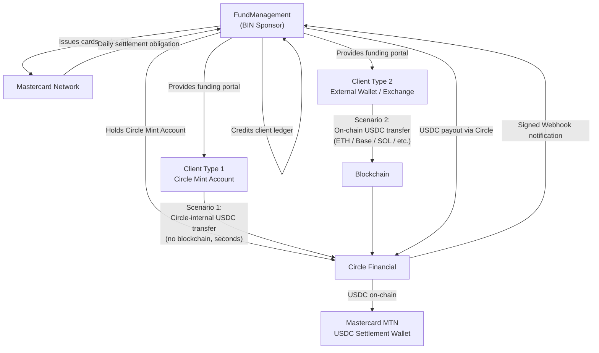
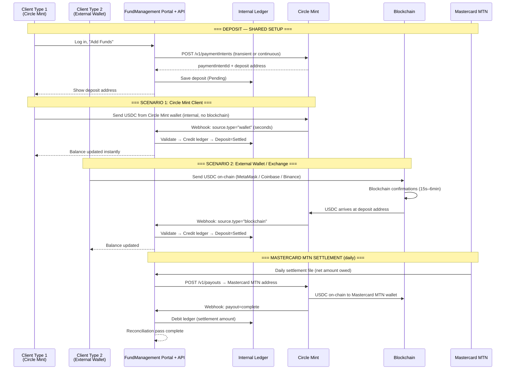
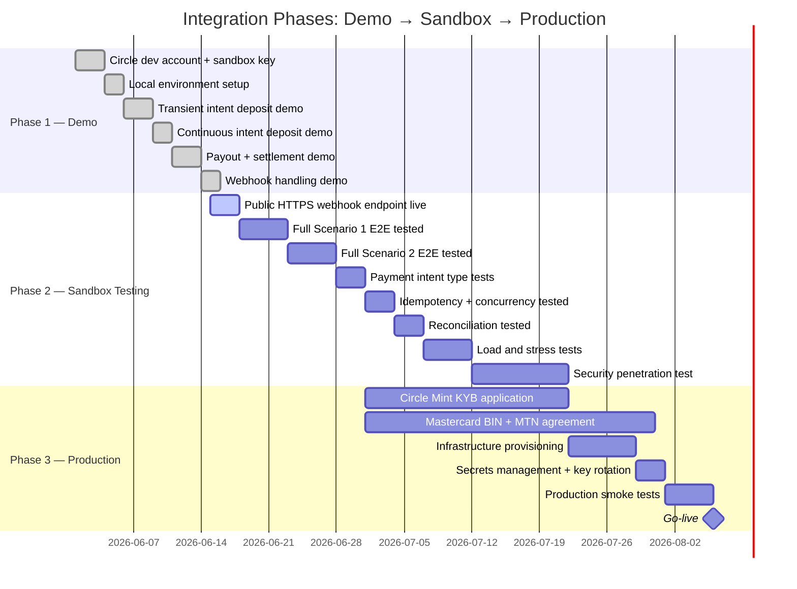

# Circle USDC Integration — Management Brief

| Field | Value |
|---|---|
| Version | 2.0 |
| Date | 2026-06-06 |
| Audience | CEO · CFO · Product · Compliance · Legal |
| Related Files | [Index](KB_INDEX.md) · [Technical](KB_TECHNICAL.md) · [QA](KB_QA.md) · [Operations](KB_OPERATIONS.md) |

---

## 1. Executive Summary

FundManagement operates as a **BIN Sponsor** — a licensed financial institution holding a Bank Identification Number (BIN) range issued by Mastercard. This grants the right to issue prepaid/debit cards to clients.

FundManagement holds a **Circle Mint Account** — Circle Financial's business-grade USDC product — enabling direct, fee-free conversion between USD and USDC, plus API-driven USDC receipt and transmission across 14+ blockchains.

### What This System Does

| Function | How |
|---|---|
| Accept client USDC deposits | Circle Crypto Deposits API — Payment Intents |
| Track client balances | Internal PostgreSQL ledger — append-only, audit-ready |
| Settle with Mastercard | Circle Crypto Payouts API → Mastercard MTN (USDC on-chain) |

### What This System Does NOT Do

| Out of Scope | Handled By |
|---|---|
| Card transaction authorization | Separate card processor (Marqeta or equivalent) |
| Card scheme messaging (ISO 8583) | Card processor |
| USD fiat settlement (wire) | Replaced entirely by USDC on-chain |
| KYC of clients | Your onboarding system |

### Value vs Traditional Settlement

| Traditional BIN Sponsor Settlement | This Architecture |
|---|---|
| T+2 to T+3 USD wire to Mastercard | Same-day / next-hour USDC on-chain |
| SWIFT / correspondent bank fees | Blockchain gas fees only (< $0.01 on Base/Solana) |
| Banking hours only | 24/7/365 |
| Complex nostro/vostro reconciliation | On-chain truth + internal ledger |

---

## 2. Business Model & Value Proposition

### Revenue Streams

| Stream | Mechanism |
|---|---|
| Card interchange | % of each card transaction (Mastercard interchange fee) |
| Float / yield | USD yield on USDC held in Circle Mint (T-bill backed) |
| Card issuance fee | One-time or annual fee per card issued to client |
| Transaction fee | Small fee per deposit or withdrawal |
| FX spread | If clients deposit non-USD stablecoins and conversion occurs |

### Circle Mint — Why It Matters

Circle Mint is not a bank account. It is Circle's institutional product giving verified businesses:
- USD → USDC at 1:1, zero fee
- USDC → USD at 1:1, zero fee
- Send USDC to any blockchain address globally
- Receive USDC from any blockchain address
- Business-grade USDC treasury with Circle acting as custodian
- 1:1 USDC reserve — every USDC is backed by USD held in regulated instruments

---

## 3. Key Stakeholders & Roles



| Stakeholder | Role | Key Responsibility |
|---|---|---|
| FundManagement | BIN Sponsor, platform operator | Run the platform; manage Circle Mint account; settle with Mastercard |
| Circle Financial | USDC infrastructure | Process deposits/payouts; fire webhooks; custody USDC |
| Mastercard | Card network | Clear card transactions; receive USDC settlement via MTN |
| Client — Type 1 (Circle Mint) | Cardholder with Circle Mint account | Funds account via Circle-to-Circle transfer |
| Client — Type 2 (External) | Cardholder using MetaMask, Coinbase, Binance, etc. | Funds account via on-chain USDC transfer |
| Your Banking Partner | Fiat on/off ramp | USD ↔ USDC conversion if needed via Circle Mint fiat rails |

---

## 4. End-to-End Business Flows (Plain Language)

### Important: Card Spend Is a Separate System

When a client uses their Mastercard card at a merchant, that authorization is processed by a **separate card processor** (e.g. Marqeta). FundManagement's Circle integration handles **only the USDC side**: receiving funds in, and sending settlement out. Card authorization and ISO 8583 messaging are outside this document's scope.

---

### Flow A-1 — Client Funds Account: Scenario 1 (Circle Mint Account)

**When to use:** Client is a business that already holds a Circle Mint account.

```
Step 1:  Client logs into FundManagement portal
Step 2:  Client clicks "Add Funds" → selects "Circle Mint" as source, enters amount
Step 3:  System creates a Circle Payment Intent (Transient or Continuous — see section 5)
Step 4:  Portal shows the deposit address for the client to use
Step 5:  Client opens their own Circle Mint console (or uses Circle API)
Step 6:  Client initiates a USDC send from their Circle Mint wallet to the deposit address
Step 7:  Circle processes the transfer internally — no blockchain is involved
Step 8:  Circle fires a signed webhook to FundManagement: transfer type = wallet
Step 9:  FundManagement validates signature, checks for duplicate, credits ledger
Step 10: Client sees updated balance in portal — typically within seconds
```

**Key characteristics:**
- No gas fees
- No blockchain confirmations needed
- Webhook: `transfer.source.type = "wallet"`
- Settlement: seconds

---

### Flow A-2 — Client Funds Account: Scenario 2 (External Wallet / Exchange)

**When to use:** Client holds USDC in MetaMask, Coinbase, Binance, Kraken, Trust Wallet, Ledger, or any self-custodial wallet.

```
Step 1:  Client logs into FundManagement portal
Step 2:  Client clicks "Add Funds" → selects blockchain (ETH / Base / SOL / etc.), enters amount
Step 3:  System creates a Circle Payment Intent — a unique deposit address for that chain
Step 4:  Portal shows deposit address + QR code

         IF client uses a self-custodial wallet (MetaMask, Trust Wallet, Ledger, Phantom):
Step 5a:   Client opens their wallet app → pastes address → sends USDC → signs & confirms
         IF client uses a custodial exchange (Coinbase, Binance, Kraken, etc.):
Step 5b:   Client logs into exchange → Withdraw / Send → USDC → enters deposit address → confirms
           (Exchange may have internal processing time: typically 5–30 minutes)

Step 6:  USDC travels on-chain to the deposit address (blockchain confirmation time)
Step 7:  Circle detects the confirmed transfer and fires a signed webhook: type = blockchain
Step 8:  FundManagement validates signature, checks for duplicate, credits ledger
Step 9:  Client sees updated balance in portal
```

**Key characteristics:**
- Client pays blockchain gas fee from their wallet
- Blockchain confirmation time: ~15 sec (Base/SOL) to ~6 min (ETH)
- Exchange withdrawals add processing time (Coinbase: typically 5–30 min)
- Webhook: `transfer.source.type = "blockchain"`
- Sender address recorded for AML screening

---

### Flow C — Mastercard USDC Settlement (Your Obligation as BIN Sponsor)

**This runs on a scheduled basis — typically once per day.**

```
Step 1:  Mastercard delivers daily settlement file specifying net amount owed by your BIN
Step 2:  FundManagement settlement job reads the file, derives the USDC amount
Step 3:  System verifies Circle Mint balance is sufficient
Step 4:  If Mastercard MTN address not yet registered: register it in Circle Address Book
Step 5:  Circle Payout created: USDC sent to Mastercard's MTN settlement address
Step 6:  USDC travels on-chain to Mastercard's wallet (seconds to minutes)
Step 7:  Circle fires webhook: payout = complete
Step 8:  FundManagement records settlement complete; debit ledger
Step 9:  Reconciliation: compare settlement file total vs Circle payout vs ledger debit
```

**Key characteristics:**
- Mastercard MTN address registered once; reused every settlement cycle
- Idempotency key derived from settlement date — safe to retry if job fails
- Settlement chain: recommended **Base** or **Solana** (< $0.01 gas, seconds to confirm)
- If payout fails: ops team alerted; settlement retried next cycle

---

### Full Sequence Diagram



---

## 5. Payment Intent Types — Business Perspective

Circle offers two types of payment intents. The choice affects client experience and operational complexity.

### Transient Intent — Single-Use

- Client gets a **fresh deposit address for each transaction**
- Address expires after 24 hours if no payment received
- After one successful payment, address is closed — cannot receive more
- **Client must return to the portal for each top-up**
- Simpler operationally; exact amount per request tracked

**Best for:** Infrequent, one-off funding requests; compliance-sensitive scenarios where per-transaction tracking is critical.

### Continuous Intent — Permanent Deposit Address

- Client receives a **permanent, reusable deposit address** (one per chain per client)
- Address never expires (until you explicitly close it)
- Can receive **unlimited USDC payments over time** — each fires a separate webhook
- Client can save the address and reuse it for all future top-ups
- **Better UX** for frequent funders — no need to request a new address each time

**Best for:** Regular clients who top up frequently; treasury-style funding where the client prefers a fixed address.

**Risk to manage:** The same address accepts USDC from any source. Your system credits based on webhook delivery — not on who sent. Ensure idempotency and monitoring on all incoming transfers.

---

## 6. Mastercard USDC Settlement — Business Explanation

### What is Mastercard MTN?

Mastercard's **Multi-Token Network (MTN)** is Mastercard's blockchain infrastructure for institutional settlement. It allows BIN Sponsors to settle net card transaction obligations using USDC instead of USD wire transfers.

**Advantages over traditional wire:**

| | USD Wire | USDC via MTN |
|---|---|---|
| Settlement time | T+1 banking days | Minutes on-chain |
| Availability | Banking hours (SWIFT) | 24/7/365 |
| Cost | SWIFT fees + correspondent bank | Blockchain gas (<$0.01 on Base) |
| Auditability | Statement reconciliation | On-chain verifiable |

### Your Settlement Obligation

As BIN Sponsor, every card transaction creates a **net daily obligation to Mastercard**. Traditionally this is settled via USD wire. Under this architecture:

1. Mastercard provides a USDC settlement wallet address (MTN) during BIN agreement setup
2. FundManagement registers that address in Circle Address Book (one-time)
3. Daily: FundManagement sends USDC to that address via Circle Payout
4. Mastercard's MTN system credits the settlement — your BIN obligation is cleared

> **Mastercard MTN address must be provided directly by Mastercard as part of your BIN Sponsor agreement. Confirm the address with Mastercard's treasury team before first use.**

---

## 7. Risk & Compliance Overview

### Regulatory Requirements

| Requirement | Owner | Notes |
|---|---|---|
| KYB — Circle Mint account | FundManagement → Circle | Required before production access; 2–4 week process |
| KYC — Client onboarding | FundManagement | Required per client before funding allowed |
| AML / CFT screening | FundManagement | Screen all deposit source addresses (Scenario 2) |
| OFAC sanctions screening | FundManagement | Block transfers from sanctioned addresses |
| BIN License | Mastercard + Banking Sponsor | Jurisdiction-specific |
| Payment Institution License | FundManagement or sponsor bank | Jurisdiction-specific |

### Key Risks & Mitigations

| Risk | Likelihood | Mitigation |
|---|---|---|
| USDC depegging from USD | Low (Circle maintains 1:1 reserves) | Monitor USDC/USD price; Circle redeemable at par |
| Blockchain congestion delays settlement | Medium | Use Base or Solana (fast chains); retry logic |
| Circle service downtime | Low | Monitor status.circle.com; polling fallback for deposit confirmation |
| Webhook delivery failure | Medium | Idempotency + hourly reconciliation polling job |
| Duplicate webhook credit | Low | `transfer.id` idempotency; DB unique constraint |
| Sanctioned address deposit (Sc2) | Low | OFAC screening on `transfer.source.address` before crediting |
| Continuous intent receiving unexpected USDC | Low | Monitor all incoming transfers; attribute via webhook only |
| Circle Mint balance insufficient for settlement | Medium | Monitor balance daily; auto-alert at < 2× daily settlement amount |

### Compliance Checklist for Go-Live

- [ ] Circle Mint KYB approved
- [ ] Legal entity established in jurisdiction
- [ ] Mastercard BIN Sponsor agreement signed
- [ ] AML policy documented and active
- [ ] KYC process for client onboarding operational
- [ ] OFAC / sanctions screening on all Scenario 2 deposit addresses
- [ ] SOC 2 / ISO 27001 security posture confirmed
- [ ] Incident response plan documented and rehearsed
- [ ] Data protection compliance confirmed (GDPR if EU clients)

---

## 8. Go-to-Market Phases



### Phase 1 — Demo (Weeks 1–2)

- Circle sandbox API (`api-sandbox.circle.com`)
- API key prefix: `SAND_API_KEY_`
- No real money; no real blockchain
- Webhook testing via ngrok / webhook.site
- **Deliverable**: Working demo covering both client scenarios and both intent types

### Phase 2 — Sandbox Testing (Weeks 3–8)

- Same Circle sandbox but deployed to staging server with public HTTPS endpoint
- Full automated regression test suite (37 scenarios per QA guide)
- Penetration test by external security firm
- **Deliverable**: Signed-off QA test report; zero open critical/high findings

### Phase 3 — Production (Weeks 9+)

- Circle Mint KYB approved
- Mastercard BIN and MTN agreement in place
- Production API key (`LIVE_API_KEY_`)
- HSM or cloud secrets manager for key storage
- 24/7 monitoring active
- **Deliverable**: Live production system processing real USDC

---

## 9. Fee Structure

### Circle Fees

| Activity | Fee |
|---|---|
| USD → USDC | Free (Circle Mint benefit) |
| USDC → USD | Free (Circle Mint benefit) |
| Receiving USDC (any source) | Free |
| Sending USDC (payout) | Gas fee passed through |
| Circle Mint account | Free for qualified businesses |

### Blockchain Gas Fees (Production Estimates)

| Chain | Avg Transfer Cost | Settlement Time |
|---|---|---|
| Ethereum (ETH) | $2–$20 | ~6 min |
| Base (BASE) | < $0.01 | ~20 sec |
| Solana (SOL) | < $0.01 | ~15 sec |
| Polygon (POLY) | < $0.01 | ~4 min |
| Arbitrum (ARB) | < $0.05 | ~20 sec |

> **Recommendation:** Use **Base** or **Solana** for all payouts including Mastercard settlement — lowest cost, fastest confirmation.
