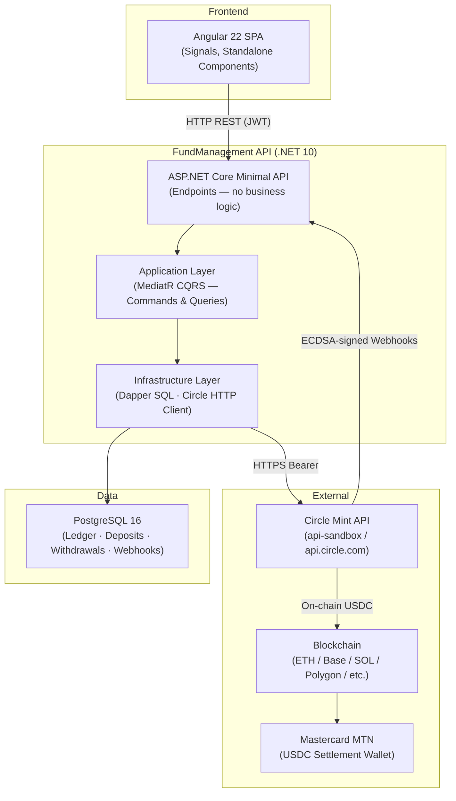
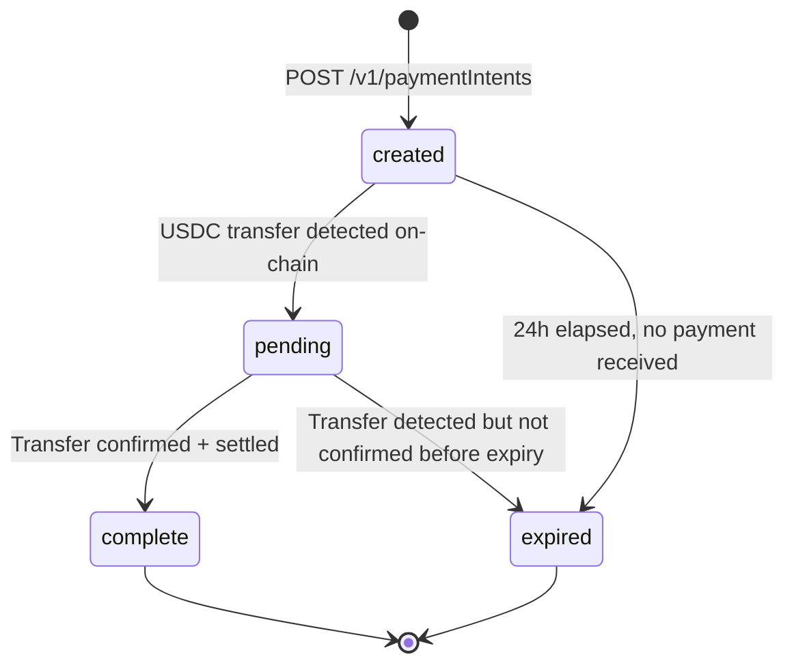
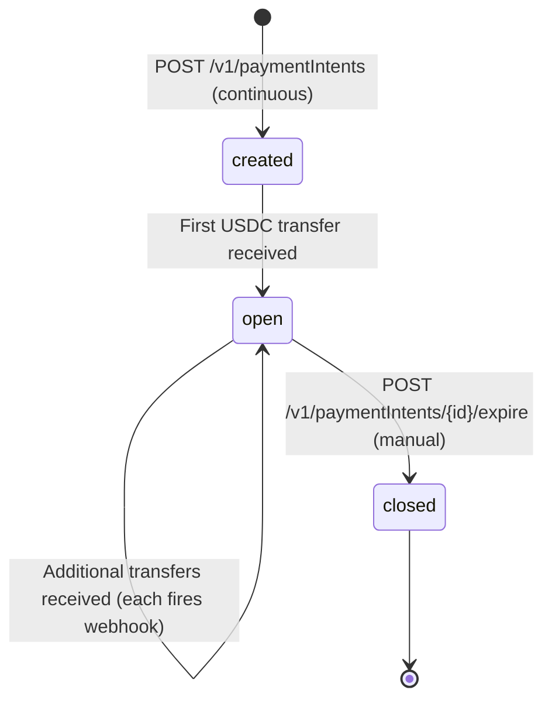
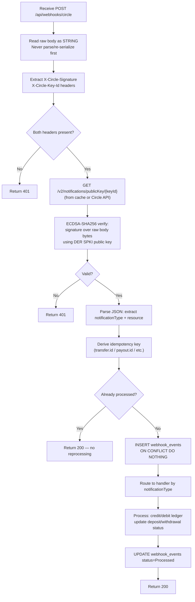

# Circle USDC Integration — Technical Reference

| Field | Value |
|---|---|
| Version | 2.0 |
| Date | 2026-06-06 |
| Audience | Engineering · Architecture |
| Related Files | [Index](KB_INDEX.md) · [Management](KB_MANAGEMENT.md) · [QA](KB_QA.md) · [Operations](KB_OPERATIONS.md) |

---

## Table of Contents

1. [System Architecture](#1-system-architecture)
2. [Environment Guide](#2-environment-guide-demo--sandbox--production)
3. [Circle Mint Account Setup](#3-circle-mint-account-setup)
4. [Payment Intent Types](#4-payment-intent-types)
5. [Deposit Flow — Technical](#5-deposit-flow--technical)
6. [Withdrawal & Payout Flow](#6-withdrawal--payout-flow)
7. [Mastercard MTN Settlement — Technical](#7-mastercard-mtn-settlement--technical)
8. [Webhook Integration](#8-webhook-integration)
9. [Idempotency & Duplicate Protection](#9-idempotency--duplicate-protection)
10. [Security Architecture](#10-security-architecture)
11. [Database Schema](#11-database-schema)
12. [Internal API Reference](#12-internal-api-reference)
13. [Circle API Reference](#13-circle-api-reference)
14. [Error Codes & Handling](#14-error-codes--handling)

---

## 1. System Architecture

### Layer Diagram



### Layer Rules (Enforced)

```
Domain         Zero external deps. Entities and value objects only.
Application    MediatR commands/queries/handlers. Interfaces only — no implementation.
Infrastructure Implements Application interfaces. Dapper + raw SQL. Circle HTTP calls.
API            Minimal API endpoints. One job: dispatch to MediatR. No business logic.
```

### Component Map

| Component | Responsibility |
|---|---|
| `WebhooksController` | Receive raw body; extract headers; dispatch `ProcessWebhookCommand` |
| `WebhookService` | ECDSA validation; idempotency check; route by `notificationType` |
| `DepositService` | Create Payment Intent; settle deposit on transfer webhook |
| `WithdrawalService` | Create Address Book recipient; poll for active; create payout |
| `SettlementService` | Scheduled Mastercard settlement job |
| `LedgerService` | Single authority for creating ledger entries |
| `CircleClient` | All HTTP calls to Circle — typed DTOs; retry logic |
| `ReconciliationService` | Compare Circle records vs internal ledger; raise alerts on mismatch |
| `PublicKeyCache` | In-memory cache of Circle ECDSA public keys (keyed by `keyId`) |

---

## 2. Environment Guide: Demo → Sandbox → Production

| Property | Demo (Local) | Sandbox (Staging) | Production |
|---|---|---|---|
| Circle Base URL | `https://api-sandbox.circle.com` | `https://api-sandbox.circle.com` | `https://api.circle.com` |
| API Key Prefix | `SAND_API_KEY_` | `SAND_API_KEY_` | `LIVE_API_KEY_` |
| Real Money | No | No | Yes |
| Real Blockchain | No (Circle simulates) | Testnet optional | Mainnet only |
| Webhook Endpoint | ngrok tunnel | Public HTTPS server | Production HTTPS + WAF |
| Key Storage | `appsettings.Development.json` (gitignored) | CI environment variable | Azure Key Vault / AWS SM |

### Configuration

```json
// appsettings.json — committed; placeholder values only
{
  "ConnectionStrings": {
    "DefaultConnection": "Host=localhost;Port=5432;Database=ifs_poc;Username=postgres;Password=localdev"
  },
  "Circle": {
    "ApiKey": "SAND_API_KEY_HERE",
    "BaseUrl": "https://api-sandbox.circle.com"
  },
  "Mastercard": {
    "SettlementAddress": "MASTERCARD_MTN_ADDRESS_HERE",
    "SettlementChain": "BASE",
    "SettlementScheduleCron": "0 10 * * *"
  }
}
```

```json
// appsettings.Development.json — gitignored; real sandbox key
{
  "Circle": {
    "ApiKey": "SAND_API_KEY_XXXXXXXXXXXX",
    "BaseUrl": "https://api-sandbox.circle.com"
  }
}
```

Production values loaded exclusively from secrets manager at runtime — never in any file.

### API Key Migration: Sandbox → Production

1. Log into https://console.circle.com
2. Click "Access Mainnet" → complete KYB
3. After approval: API Keys → Create Production Key (`LIVE_API_KEY_` prefix)
4. Update `Circle:BaseUrl` to `https://api.circle.com`
5. Update `Circle:ApiKey` in secrets manager
6. Deploy — no code changes required

---

## 3. Circle Mint Account Setup

### Developer Account (Sandbox — immediate)

1. Go to https://console.circle.com
2. Create account with business email
3. Verify email → sandbox access granted immediately
4. Navigate to API Keys → Create Key (`SAND_API_KEY_` prefix)

### KYB Application (Production — 2–4 weeks)

Required documents typically include:
- Certificate of Incorporation
- Articles of Association / Memorandum
- Proof of registered business address
- Full list of directors + government ID for each
- UBO disclosure — any entity owning >25%
- AML/KYC policy document
- Banking references
- Business description and intended use case

**Process:** Console → Access Mainnet → complete form → upload documents → Circle compliance review → approval email → production key issued.

### Register Webhook Endpoint

```bash
curl -X POST https://api-sandbox.circle.com/v1/notifications/subscriptions \
  -H "Authorization: Bearer SAND_API_KEY_XXXX" \
  -H "Content-Type: application/json" \
  -d '{"endpoint": "https://your-server.com/api/webhooks/circle"}'
```

Circle will POST a test notification to verify the endpoint is reachable. Respond with `200 OK`.

### Verify Account Connectivity

```bash
curl https://api-sandbox.circle.com/ping
# → {"message":"pong"}

curl https://api-sandbox.circle.com/v1/configuration \
  -H "Authorization: Bearer SAND_API_KEY_XXXX"
# → account config including wallet IDs

curl https://api-sandbox.circle.com/v1/businessAccount/balances \
  -H "Authorization: Bearer SAND_API_KEY_XXXX"
# → current USDC and other stablecoin balances
```

---

## 4. Payment Intent Types

This is the most operationally significant design decision for client deposits. Read this section fully before implementing.

### Overview

Circle's `POST /v1/paymentIntents` accepts a `paymentIntentType` field:

| | `transient` (default) | `continuous` |
|---|---|---|
| Address lifetime | 24 hours (default) or until first payment | Permanent until manually expired |
| Payments accepted | 1 — then moves to `complete` | Unlimited — stays `open` after each payment |
| Intent status after payment | `complete` (terminal) | `open` (continues accepting) |
| Webhook fires | Once per payment (typically once) | Once per payment (multiple times over intent life) |
| Close mechanism | Auto (on payment or expiry) | Manual: `POST /v1/paymentIntents/{id}/expire` |
| `paymentIds` array | Contains the single settled transfer ID | Grows with each received transfer |
| Best for | One-time top-up per session | Permanent client deposit address |
| UX | Client requests address each time | Client saves address once, reuses forever |

### Transient Intent — Full Detail

#### When to Use

- One-time or infrequent funding where per-transaction amount control matters
- Compliance scenarios where each funding event must be individually initiated
- Any case where address reuse is undesirable

#### Request

```http
POST https://api-sandbox.circle.com/v1/paymentIntents
Authorization: Bearer SAND_API_KEY_XXXX
Content-Type: application/json

{
  "idempotencyKey": "550e8400-e29b-41d4-a716-446655440000",
  "paymentIntentType": "transient",
  "amount": {
    "amount": "500.00",
    "currency": "USD"
  },
  "settlementCurrency": "USD",
  "paymentMethods": [
    {
      "type": "blockchain",
      "chain": "BASE"
    }
  ]
}
```

Note: `"paymentIntentType": "transient"` is also the default if the field is omitted.

#### Response

```json
{
  "data": {
    "id": "fc988ed5-c129-4f70-a064-e5beb7eb8e32",
    "paymentIntentType": "transient",
    "amount": { "amount": "500.00", "currency": "USD" },
    "settlementCurrency": "USD",
    "paymentMethods": [
      {
        "type": "blockchain",
        "chain": "BASE",
        "address": "0x618ceea8c0d120f642a4c63f74e7e0c9c7e7b00d"
      }
    ],
    "paymentIds": [],
    "status": "created",
    "expiresOn": "2026-06-07T10:00:00Z",
    "createDate": "2026-06-06T10:00:00Z"
  }
}
```

#### Status Flow



#### Webhook Behavior

Fires **once** when transfer completes:
- `notificationType: "transfers"`
- `transfer.status: "complete"` → credit ledger
- `transfer.status: "failed"` → mark deposit failed

After `complete`: address will not accept further payments. Client must create new intent for next top-up.

#### Expiry

Default: 24 hours. Can be forced early:
```http
POST /v1/paymentIntents/{id}/expire
```
On expiry: no credit, deposit remains `Pending` → your reconciliation job marks it `Expired`.

---

### Continuous Intent — Full Detail

#### When to Use

- Regular clients who fund their account multiple times
- Treasury-style accounts needing a stable, bookmarkable deposit address
- Scenarios where issuing a new address per session adds unnecessary friction
- Clients who want to automate recurring USDC funding from their system

#### Request

```http
POST https://api-sandbox.circle.com/v1/paymentIntents
Authorization: Bearer SAND_API_KEY_XXXX
Content-Type: application/json

{
  "idempotencyKey": "a3b4c5d6-e7f8-9a0b-1c2d-3e4f5a6b7c8d",
  "paymentIntentType": "continuous",
  "settlementCurrency": "USD",
  "paymentMethods": [
    {
      "type": "blockchain",
      "chain": "BASE"
    }
  ]
}
```

Note: **No `amount` field** — continuous intents accept any amount, unlimited times.

#### Response

```json
{
  "data": {
    "id": "aa112233-4455-6677-8899-aabbccddeeff",
    "paymentIntentType": "continuous",
    "settlementCurrency": "USD",
    "paymentMethods": [
      {
        "type": "blockchain",
        "chain": "BASE",
        "address": "0xabcdef1234567890abcdef1234567890abcdef12"
      }
    ],
    "paymentIds": [],
    "status": "created",
    "expiresOn": null,
    "createDate": "2026-06-06T10:00:00Z"
  }
}
```

#### Status Flow



#### Webhook Behavior

Fires **once per incoming transfer** — each time USDC is received at the deposit address:

**Transfer 1:**
```json
{
  "clientId": "c60d2d5b-...",
  "notificationType": "transfers",
  "transfer": {
    "id": "transfer-uuid-001",
    "status": "complete",
    "amount": { "amount": "100.00", "currency": "USD" },
    "paymentIntentId": "aa112233-..."
  }
}
```

**Transfer 2 (later):**
```json
{
  "clientId": "c60d2d5b-...",
  "notificationType": "transfers",
  "transfer": {
    "id": "transfer-uuid-002",
    "status": "complete",
    "amount": { "amount": "250.00", "currency": "USD" },
    "paymentIntentId": "aa112233-..."
  }
}
```

Each transfer has a unique `transfer.id` — your idempotency check runs on `transfer.id`, not `paymentIntentId`. The same intent can generate dozens of webhooks over its lifetime.

#### Closing a Continuous Intent

When a client leaves the platform or changes their deposit address:

```http
POST /v1/paymentIntents/{id}/expire
Authorization: Bearer SAND_API_KEY_XXXX
```

After expiry: address stops accepting payments; status moves to `closed`. Create a new continuous intent if needed.

#### Data Model for Continuous Intents

Because one continuous intent maps to multiple deposits, the database relationship differs from transient:

```sql
-- For continuous intents, circle_payment_intent_id is NOT unique per deposit
-- Each USDC transfer from the same continuous intent creates a new deposit row
-- Uniqueness is on the transfer ID (stored in ledger_entries.reference_id)

-- Deposits table: circle_payment_intent_id may repeat for continuous intents
-- Add intent_type column and remove UNIQUE constraint on circle_payment_intent_id
-- for continuous intents (or use a partial index)

ALTER TABLE deposits ADD COLUMN intent_type TEXT NOT NULL DEFAULT 'transient'
  CHECK (intent_type IN ('transient', 'continuous'));

-- For transient: one deposit per payment intent (UNIQUE enforced)
-- For continuous: many deposits per payment intent (no uniqueness on payment_intent_id)
-- Unique deposit identity = (circle_payment_intent_id, circle_transfer_id) for continuous
ALTER TABLE deposits ADD COLUMN circle_transfer_id TEXT;
CREATE UNIQUE INDEX uq_deposits_transient
  ON deposits (circle_payment_intent_id)
  WHERE intent_type = 'transient';
CREATE UNIQUE INDEX uq_deposits_continuous
  ON deposits (circle_payment_intent_id, circle_transfer_id)
  WHERE intent_type = 'continuous';
```

### Comparison: When to Use Which

| Factor | Use Transient | Use Continuous |
|---|---|---|
| Client funds once per session | Yes | No |
| Client funds multiple times per week | No | Yes |
| Compliance requires per-session intent creation | Yes | No |
| Client wants to automate recurring funding | No | Yes |
| You want exact amount control per deposit | Yes | No |
| Simplest implementation | Yes | No |
| Best UX for frequent funders | No | Yes |

### Multi-Chain Support

Both intent types support multiple `paymentMethods` chains in a single intent:

```json
{
  "paymentIntentType": "continuous",
  "settlementCurrency": "USD",
  "paymentMethods": [
    { "type": "blockchain", "chain": "BASE" },
    { "type": "blockchain", "chain": "ETH" },
    { "type": "blockchain", "chain": "SOL" }
  ]
}
```

This generates **one unique deposit address per chain**. The client can fund from any of the supported chains — each transfer fires a separate webhook.

### Supported Chains for Payment Intents

`ALGO ARB AVAX BASE ETH HBAR NEAR NOBLE OP POLY SOL XLM UNICHAIN WORLDCHAIN`

---

## 5. Deposit Flow — Technical

### Scenario Comparison

| Property | Scenario 1: Circle Mint Client | Scenario 2: External Wallet / Exchange |
|---|---|---|
| Webhook `transfer.source.type` | `"wallet"` | `"blockchain"` |
| Webhook `transfer.source.id` | Circle wallet UUID of sender | Not present |
| Webhook `transfer.source.chain` | Not present | `"ETH"` / `"BASE"` / `"SOL"` etc. |
| Webhook `transfer.source.address` | Not present | Sender's blockchain address |
| Webhook `transfer.transactionHash` | Not present | On-chain tx hash |
| Confirmation wait | None | Chain-dependent (15s–6min) |
| AML screening needed | No (Circle-internal) | Yes — screen `source.address` |

### Blockchain Confirmation Requirements (Scenario 2)

| Chain | Confirmations | Approx Wait |
|---|---|---|
| Ethereum (ETH) | 30 | ~6 min |
| Base (BASE) | 10 | ~20 sec |
| Solana (SOL) | 32 | ~15 sec |
| Polygon (POLY) | 200 | ~4 min |
| Arbitrum (ARB) | 10 | ~20 sec |
| Optimism (OP) | 10 | ~20 sec |
| Avalanche (AVAX) | 20 | ~1 min |

### Step 1 — Create Payment Intent

```http
POST https://api-sandbox.circle.com/v1/paymentIntents
Authorization: Bearer SAND_API_KEY_XXXX
Content-Type: application/json

// Transient (single use, 24h expiry)
{
  "idempotencyKey": "550e8400-e29b-41d4-a716-446655440000",
  "paymentIntentType": "transient",
  "amount": { "amount": "100.00", "currency": "USD" },
  "settlementCurrency": "USD",
  "paymentMethods": [{ "type": "blockchain", "chain": "BASE" }]
}

// Continuous (permanent, reusable)
{
  "idempotencyKey": "a3b4c5d6-e7f8-9a0b-1c2d-3e4f5a6b7c8d",
  "paymentIntentType": "continuous",
  "settlementCurrency": "USD",
  "paymentMethods": [{ "type": "blockchain", "chain": "BASE" }]
}
```

Store `id` (paymentIntentId) and `paymentMethods[n].address` (the deposit address to show client).

### Step 2 — Client Sends USDC

**Scenario 1 (Circle Mint):** Client sends from their Circle Mint console to the deposit address.
**Scenario 2 (External):** Client sends on-chain from their wallet/exchange.

### Step 3 — Receive Transfer Webhook

**Scenario 1 payload (source.type = "wallet"):**
```json
{
  "clientId": "c60d2d5b-203c-45bb-9f6e-93641d40a599",
  "notificationType": "transfers",
  "transfer": {
    "id": "transfer-uuid-001",
    "source": { "type": "wallet", "id": "client-circle-wallet-uuid" },
    "destination": { "type": "wallet", "id": "your-circle-wallet-id" },
    "amount": { "amount": "100.00", "currency": "USD" },
    "status": "complete",
    "paymentIntentId": "fc988ed5-..."
  }
}
```

**Scenario 2 payload (source.type = "blockchain"):**
```json
{
  "clientId": "c60d2d5b-203c-45bb-9f6e-93641d40a599",
  "notificationType": "transfers",
  "transfer": {
    "id": "transfer-uuid-001",
    "source": { "type": "blockchain", "chain": "BASE", "address": "0xabc123..." },
    "destination": { "type": "wallet", "id": "your-circle-wallet-id" },
    "amount": { "amount": "100.00", "currency": "USD" },
    "status": "complete",
    "transactionHash": "0xdef456...",
    "paymentIntentId": "fc988ed5-..."
  }
}
```

### Step 4 — Handler: Source-Type Detection

```csharp
private async Task HandleTransferAsync(TransferPayload transfer)
{
    string sourceInfo;
    if (transfer.Source.Type == "wallet")
    {
        // Scenario 1: Circle Mint client — no tx hash, instant
        sourceInfo = $"CircleMint:{transfer.Source.Id}";
        _logger.LogInformation("Deposit from Circle Mint wallet {WalletId}", transfer.Source.Id);
    }
    else if (transfer.Source.Type == "blockchain")
    {
        // Scenario 2: External — has tx hash; AML screen source address
        sourceInfo = $"{transfer.Source.Chain}:{transfer.Source.Address}";
        _logger.LogInformation("Deposit from {Chain}:{Address} txHash:{TxHash}",
            transfer.Source.Chain, transfer.Source.Address, transfer.TransactionHash);

        await _complianceService.ScreenAddressAsync(
            transfer.Source.Address, transfer.Source.Chain);
    }

    // Settlement logic is identical for both scenarios
    await SettleDepositAsync(transfer);
}
```

### Step 5 — Atomic Settlement SQL

```sql
BEGIN;
  -- Idempotency: INSERT or skip
  INSERT INTO webhook_events (id, circle_event_id, event_type, payload, status)
  VALUES (gen_random_uuid(), @transferId, 'transfers', @payload::jsonb, 'Received')
  ON CONFLICT (circle_event_id) DO NOTHING;

  -- Only proceed if INSERT actually happened (not a duplicate)
  -- (handled in C# by checking rows affected)

  -- For transient: find deposit by paymentIntentId
  UPDATE deposits
  SET status = 'Settled',
      circle_transfer_id = @transferId,
      transfer_source_type = @sourceType,
      transfer_source_address = @sourceAddress,   -- null for wallet type
      transfer_source_wallet_id = @sourceWalletId, -- null for blockchain type
      transaction_hash = @txHash,                  -- null for wallet type
      updated_at = NOW()
  WHERE circle_payment_intent_id = @paymentIntentId
    AND status = 'Pending';

  -- Create ledger credit
  INSERT INTO ledger_entries (id, funding_account_id, entry_type, amount, reference_id)
  VALUES (gen_random_uuid(), @fundingAccountId, 'Credit', @amount, @transferId);

  -- Mark webhook processed
  UPDATE webhook_events SET status = 'Processed', processed_at = NOW()
  WHERE circle_event_id = @transferId;
COMMIT;
```

### Fallback: Polling (When Webhook Fails)

Your reconciliation job polls all `Pending` deposits older than 30 minutes:

```csharp
// ReconciliationService — run every 30 minutes
var staleDeposits = await _db.QueryAsync<Deposit>(
    "SELECT * FROM deposits WHERE status = 'Pending' AND created_at < NOW() - INTERVAL '30 minutes'");

foreach (var deposit in staleDeposits)
{
    var intent = await _circleClient.GetPaymentIntentAsync(deposit.CirclePaymentIntentId);
    if (intent.Status == "complete" && intent.PaymentIds.Any())
    {
        // Settle via polling fallback
        var transferId = intent.PaymentIds.First();
        var transfer = await _circleClient.GetTransferAsync(transferId);
        await SettleDepositAsync(transfer);
    }
    else if (intent.Status == "expired")
    {
        await MarkDepositExpiredAsync(deposit.Id);
    }
}
```

---

## 6. Withdrawal & Payout Flow

Covers: client withdrawal to their own wallet + Mastercard settlement payout (same API, different recipient).

### Step 1 — Register Address Book Recipient

```http
POST https://api-sandbox.circle.com/v1/addressBook/recipients
Authorization: Bearer SAND_API_KEY_XXXX
Content-Type: application/json

{
  "idempotencyKey": "a4e8b3c1-5d6e-7f8a-9b0c-1d2e3f4a5b6c",
  "chain": "BASE",
  "address": "0xDestinationAddress...",
  "nickname": "Client-001-BASE"
}
```

Response includes `id` (recipientId) and `status: "pending"`.

### Step 2 — Wait for Recipient to Become Active

Poll `GET /v1/addressBook/recipients/{id}` until `status == "active"`.

Or subscribe to `addressBookRecipients` webhook — fires when status changes to `active`.

### Step 3 — Create Payout

```http
POST https://api-sandbox.circle.com/v1/payouts
Authorization: Bearer SAND_API_KEY_XXXX
Content-Type: application/json

{
  "idempotencyKey": "b5f9c4d2-6e7f-8a9b-0c1d-2e3f4a5b6c7d",
  "destination": {
    "type": "address_book",
    "id": "recipient-uuid-here"
  },
  "amount": {
    "amount": "100.00",
    "currency": "USD"
  }
}
```

Store `id` (payoutId) and update withdrawal record.

### Step 4 — Payout Completion Webhook

```json
// Success
{
  "clientId": "c60d2d5b-...",
  "notificationType": "payouts",
  "payout": {
    "id": "payout-uuid-456",
    "status": "complete",
    "amount": { "amount": "100.00", "currency": "USD" }
  }
}

// Failure
{
  "clientId": "c60d2d5b-...",
  "notificationType": "payouts",
  "payout": {
    "id": "payout-uuid-456",
    "status": "failed",
    "errorCode": "insufficient_funds"
  }
}
```

On `complete`: close withdrawal, create Debit ledger entry.
On `failed`: create reversal Credit ledger entry, mark withdrawal `Failed`.

### Payout Error Codes

| Error | Meaning | Action |
|---|---|---|
| `insufficient_funds` | Circle Mint balance < payout amount | Top up Circle Mint; retry same payout |
| `transaction_denied` | Compliance or risk block | Contact Circle support; investigate address |
| `transaction_failed` | On-chain failure | Retry with same idempotency key |
| `transaction_returned` | USDC returned by destination | Investigate; re-credit client |

### Supported Chains for Payouts

`ALGO ARB AVAX BASE ETH HBAR NEAR NOBLE OP POLY SOL XLM`

---

## 7. Mastercard MTN Settlement — Technical

### Configuration

```json
{
  "Mastercard": {
    "SettlementAddress": "0xMastercardMTNAddressHere",
    "SettlementChain": "BASE",
    "SettlementScheduleCron": "0 10 * * *"
  }
}
```

`SettlementAddress` is provided by Mastercard. Register it in Circle Address Book once. Reuse forever.

### Settlement Job

```csharp
public async Task RunSettlementAsync(DateTime settlementDate)
{
    // 1. Parse Mastercard settlement file
    var netUsdcOwed = await ParseSettlementFileAsync(settlementDate);

    // 2. Verify Circle balance
    var balance = await _circleClient.GetBusinessBalanceAsync();
    if (balance.Usdc < netUsdcOwed)
        throw new InsufficientBalanceException(netUsdcOwed, balance.Usdc);

    // 3. Ensure Mastercard recipient is registered and active
    var recipient = await EnsureMastercardRecipientActiveAsync();

    // 4. Create idempotent settlement withdrawal record
    var idempotencyKey = $"mc-settlement-{settlementDate:yyyy-MM-dd}";
    var existingWithdrawal = await GetWithdrawalByIdempotencyKeyAsync(idempotencyKey);
    if (existingWithdrawal?.Status == "Complete") return; // already done

    var withdrawal = existingWithdrawal ?? await CreateSettlementWithdrawalAsync(
        netUsdcOwed, settlementDate, idempotencyKey);

    // 5. Debit ledger immediately (reversal on webhook failure)
    await _ledger.CreateEntryAsync(withdrawal.FundingAccountId, EntryType.Debit,
        netUsdcOwed, withdrawal.Id.ToString());

    // 6. Submit payout to Circle
    var payout = await _circleClient.CreatePayoutAsync(new CreatePayoutRequest
    {
        IdempotencyKey = idempotencyKey,
        Destination = new AddressBookDestination { Id = recipient.Id },
        Amount = new MoneyAmount { Amount = netUsdcOwed.ToString("F2"), Currency = "USD" }
    });

    await UpdateWithdrawalPayoutIdAsync(withdrawal.Id, payout.Id);
    // Completion confirmed via payout webhook
}
```

### Settlement Reconciliation

After each settlement:
1. Mastercard file total == Circle payout amount
2. Circle payout amount == Debit ledger entry
3. On-chain amount (blockchain explorer) == Circle payout amount

All four must match within ±$0.01 tolerance.

---

## 8. Webhook Integration

### Headers

Every Circle Mint webhook POST includes:
```
X-Circle-Signature: <base64-encoded ECDSA signature>
X-Circle-Key-Id:    <UUID — identifies which public key to use for verification>
Content-Type:       application/json
```

### Critical: ECDSA not HMAC

Circle Mint uses **ECDSA_SHA_256** asymmetric signatures. Do NOT implement HMAC.

### Validation Algorithm



### ECDSA Validation Code

```csharp
private async Task<bool> ValidateSignatureAsync(
    string rawBody, string signature, string keyId)
{
    var publicKeyBase64 = await _publicKeyCache.GetOrAddAsync(keyId, async () =>
    {
        var response = await _circleClient.GetPublicKeyAsync(keyId);
        return response.Data.PublicKey; // base64-encoded DER SPKI
    });

    var publicKeyBytes = Convert.FromBase64String(publicKeyBase64);
    var signatureBytes = Convert.FromBase64String(signature);
    var bodyBytes = Encoding.UTF8.GetBytes(rawBody);

    using var ecdsa = ECDsa.Create();
    ecdsa.ImportSubjectPublicKeyInfo(publicKeyBytes, out _);

    return ecdsa.VerifyData(
        bodyBytes,
        signatureBytes,
        HashAlgorithmName.SHA256,
        DSASignatureFormat.Rfc3279DerSequence);
}
```

### Public Key Endpoint

```http
GET /v2/notifications/publicKey/{keyId}
Authorization: Bearer SAND_API_KEY_XXXX
```

```json
{ "data": { "id": "key-uuid", "algorithm": "ECDSA_SHA_256", "publicKey": "<base64 DER SPKI>" } }
```

**Cache this key.** It is static per `keyId`. Fetching on every webhook is wasteful and slow.

### Circle Sender IPs (Allowlist at WAF)

```
3.230.111.7
3.90.127.28
35.169.154.32
54.88.227.75
```

### Notification Type Routing

| `notificationType` | Resource Key | Action |
|---|---|---|
| `transfers` | `transfer` | `status=complete` → settle deposit (credit); `status=failed` → fail deposit |
| `payouts` | `payout` | `status=complete` → close withdrawal (debit); `status=failed` → reverse debit |
| `addressBookRecipients` | `addressBookRecipient` | `status=active` → allow payout submission |
| Unknown | — | Log; idempotency key = `"{notificationType}:{clientId}"`; return 200 |

### Idempotency Key Derivation

```csharp
private string DeriveIdempotencyKey(WebhookPayload payload) =>
    payload.NotificationType switch
    {
        "transfers" => payload.Transfer?.Id
            ?? throw new InvalidOperationException("transfer.id missing"),
        "payouts" => payload.Payout?.Id
            ?? throw new InvalidOperationException("payout.id missing"),
        "addressBookRecipients" => payload.AddressBookRecipient?.Id
            ?? throw new InvalidOperationException("addressBookRecipient.id missing"),
        _ => $"{payload.NotificationType}:{payload.ClientId}"
    };
```

### Important Gap: `paymentIntentId` Not Always Present

For Scenario 2 (external blockchain), the `transfer.paymentIntentId` field may be absent in some edge cases. If absent:
- Webhook stored with `status=Received` but deposit NOT settled
- Reconciliation job must detect and settle via polling fallback

See Operations runbook for recovery procedure.

---

## 9. Idempotency & Duplicate Protection

| Operation | Idempotency Key | Enforcement |
|---|---|---|
| Transient intent creation | Fresh `Guid.NewGuid()` per request | Circle deduplicates on `idempotencyKey` |
| Continuous intent creation | Derived from `customerId + chain` (SHA256) | One continuous intent per client per chain |
| Transfer webhook | `transfer.id` | `UNIQUE (circle_event_id)` in `webhook_events` |
| Payout creation | Your `Withdrawal.Id` as idempotencyKey | Circle deduplicates; safe to retry |
| Payout webhook | `payout.id` | `UNIQUE (circle_event_id)` in `webhook_events` |
| Settlement payout | `"mc-settlement-{date:yyyy-MM-dd}"` | Date-derived; one per day |

### DB Constraint

```sql
ALTER TABLE webhook_events
  ADD CONSTRAINT uq_webhook_events_circle_event_id UNIQUE (circle_event_id);
```

`INSERT ... ON CONFLICT DO NOTHING` — always return 200. Never reprocess.

---

## 10. Security Architecture

### Secrets Management

| Environment | Storage |
|---|---|
| Local dev | `appsettings.Development.json` (gitignored) |
| CI / Staging | Environment variables injected by CI pipeline |
| Production | Azure Key Vault or AWS Secrets Manager — never in files |

### Webhook Security Layers

| Layer | Control |
|---|---|
| ECDSA signature | Validate every request before any processing |
| Raw body preservation | Read as string before JSON parsing — whitespace matters for sig |
| Public key caching | Cache per `keyId`; `keyId` in header tells which key to use |
| IP allowlisting | Restrict ingress to Circle IPs at WAF/load balancer |
| Rate limiting | 429 if sustained flood detected |

### Application Security

| Concern | Control |
|---|---|
| Client API endpoints | JWT authentication |
| Webhook endpoint | No JWT; ECDSA signature instead |
| SQL | Parameterized queries only (Dapper); zero string concatenation |
| HTTPS | TLS 1.2+ minimum; HTTP disabled in production |
| CORS | Strict allowlist: Angular origin only |

### Withdrawal / Deposit Address Screening (Scenario 2)

Before crediting any deposit from a blockchain source address:
1. Check `transfer.source.address` against internal blocklist
2. Screen against OFAC SDN list
3. Consider Circle Compliance Engine (TRM integration)

Before creating any payout to an external address:
1. Same OFAC screening
2. Verify address matches client's registered withdrawal address

---

## 11. Database Schema

```sql
-- Customers
-- customer_type: 'CircleMint' (Scenario 1) or 'ExternalWallet' (Scenario 2)
CREATE TABLE customers (
    id UUID PRIMARY KEY DEFAULT gen_random_uuid(),
    name TEXT NOT NULL,
    email TEXT NOT NULL UNIQUE,
    customer_type TEXT NOT NULL CHECK (customer_type IN ('CircleMint', 'ExternalWallet')),
    circle_wallet_id TEXT,    -- populated for CircleMint customers
    created_at TIMESTAMPTZ NOT NULL DEFAULT NOW()
);

-- Funding Accounts
CREATE TABLE funding_accounts (
    id UUID PRIMARY KEY DEFAULT gen_random_uuid(),
    customer_id UUID NOT NULL REFERENCES customers(id),
    currency TEXT NOT NULL DEFAULT 'USD',
    created_at TIMESTAMPTZ NOT NULL DEFAULT NOW()
);

-- Payment Intents (tracks Circle intents we created)
CREATE TABLE payment_intents (
    id UUID PRIMARY KEY DEFAULT gen_random_uuid(),
    customer_id UUID NOT NULL REFERENCES customers(id),
    funding_account_id UUID NOT NULL REFERENCES funding_accounts(id),
    circle_payment_intent_id TEXT NOT NULL UNIQUE,
    intent_type TEXT NOT NULL CHECK (intent_type IN ('transient', 'continuous')),
    chain TEXT NOT NULL,
    deposit_address TEXT NOT NULL,
    amount NUMERIC(18,6),           -- null for continuous (any amount accepted)
    currency TEXT NOT NULL DEFAULT 'USD',
    status TEXT NOT NULL DEFAULT 'created'
        CHECK (status IN ('created', 'pending', 'open', 'complete', 'expired', 'closed')),
    expires_on TIMESTAMPTZ,         -- null for continuous
    created_at TIMESTAMPTZ NOT NULL DEFAULT NOW(),
    updated_at TIMESTAMPTZ NOT NULL DEFAULT NOW()
);

-- Deposits (one row per USDC transfer received)
CREATE TABLE deposits (
    id UUID PRIMARY KEY DEFAULT gen_random_uuid(),
    customer_id UUID NOT NULL REFERENCES customers(id),
    funding_account_id UUID NOT NULL REFERENCES funding_accounts(id),
    payment_intent_id UUID NOT NULL REFERENCES payment_intents(id),
    circle_payment_intent_id TEXT NOT NULL,
    circle_transfer_id TEXT,         -- the transfer.id from Circle webhook
    intent_type TEXT NOT NULL CHECK (intent_type IN ('transient', 'continuous')),
    amount NUMERIC(18,6) NOT NULL,
    currency TEXT NOT NULL DEFAULT 'USD',
    chain TEXT NOT NULL,
    -- Source metadata (populated on settlement)
    transfer_source_type TEXT CHECK (transfer_source_type IN ('wallet', 'blockchain')),
    transfer_source_address TEXT,    -- Scenario 2: sender blockchain address
    transfer_source_wallet_id TEXT,  -- Scenario 1: sender Circle wallet UUID
    transaction_hash TEXT,           -- Scenario 2: on-chain tx hash for audit
    status TEXT NOT NULL DEFAULT 'Pending'
        CHECK (status IN ('Pending', 'Settled', 'Expired', 'Failed')),
    created_at TIMESTAMPTZ NOT NULL DEFAULT NOW(),
    updated_at TIMESTAMPTZ NOT NULL DEFAULT NOW()
);

-- Unique constraint: one deposit per transfer
CREATE UNIQUE INDEX uq_deposits_transfer ON deposits (circle_transfer_id)
  WHERE circle_transfer_id IS NOT NULL;

-- Withdrawals
CREATE TABLE withdrawals (
    id UUID PRIMARY KEY DEFAULT gen_random_uuid(),
    customer_id UUID NOT NULL REFERENCES customers(id),
    funding_account_id UUID NOT NULL REFERENCES funding_accounts(id),
    circle_payout_id TEXT UNIQUE,
    idempotency_key TEXT UNIQUE,
    destination_address TEXT NOT NULL,
    chain TEXT NOT NULL,
    amount NUMERIC(18,6) NOT NULL,
    currency TEXT NOT NULL DEFAULT 'USD',
    is_settlement BOOLEAN NOT NULL DEFAULT FALSE,
    status TEXT NOT NULL DEFAULT 'Pending'
        CHECK (status IN ('Pending', 'Complete', 'Failed')),
    created_at TIMESTAMPTZ NOT NULL DEFAULT NOW(),
    updated_at TIMESTAMPTZ NOT NULL DEFAULT NOW()
);

-- Ledger (append-only — NEVER UPDATE OR DELETE ROWS)
CREATE TABLE ledger_entries (
    id UUID PRIMARY KEY DEFAULT gen_random_uuid(),
    funding_account_id UUID NOT NULL REFERENCES funding_accounts(id),
    entry_type TEXT NOT NULL CHECK (entry_type IN ('Credit', 'Debit')),
    amount NUMERIC(18,6) NOT NULL CHECK (amount > 0),
    reference_id TEXT NOT NULL,     -- transfer.id or payout.id
    created_at TIMESTAMPTZ NOT NULL DEFAULT NOW()
);

-- Webhook Events (idempotency store)
CREATE TABLE webhook_events (
    id UUID PRIMARY KEY DEFAULT gen_random_uuid(),
    circle_event_id TEXT NOT NULL,
    event_type TEXT NOT NULL,
    payload JSONB NOT NULL,
    status TEXT NOT NULL DEFAULT 'Received'
        CHECK (status IN ('Received', 'Processed', 'Failed')),
    error_message TEXT,
    created_at TIMESTAMPTZ NOT NULL DEFAULT NOW(),
    processed_at TIMESTAMPTZ,
    CONSTRAINT uq_webhook_events_circle_event_id UNIQUE (circle_event_id)
);

-- Balance View (ALWAYS use this — never store balance directly)
CREATE VIEW funding_account_balances AS
SELECT
    fa.id AS funding_account_id,
    fa.customer_id,
    fa.currency,
    COALESCE(SUM(
        CASE
            WHEN le.entry_type = 'Credit' THEN le.amount
            WHEN le.entry_type = 'Debit'  THEN -le.amount
        END
    ), 0) AS balance
FROM funding_accounts fa
LEFT JOIN ledger_entries le ON le.funding_account_id = fa.id
GROUP BY fa.id, fa.customer_id, fa.currency;
```

---

## 12. Internal API Reference

```
// Deposits
POST /api/deposits              Create deposit (returns payment intent + deposit address)
GET  /api/deposits/{id}         Get deposit status
GET  /api/deposits              List (filter: customerId, intentType, status, dateRange)

// Withdrawals
POST /api/withdrawals           Create withdrawal payout
GET  /api/withdrawals/{id}      Get withdrawal status
GET  /api/withdrawals           List withdrawals

// Payment Intents
POST /api/payment-intents        Create transient or continuous intent
GET  /api/payment-intents/{id}   Get intent status + all received payments
POST /api/payment-intents/{id}/expire  Close a continuous intent

// Customers
POST /api/customers             Create customer (specify type: CircleMint / ExternalWallet)
GET  /api/customers/{id}        Get customer + linked accounts
GET  /api/customers             List customers

// Funding Accounts
GET  /api/funding-accounts/{id}/balance     Current balance (from ledger view)
GET  /api/funding-accounts/{id}/ledger      Ledger entries (paginated)

// Webhooks
POST /api/webhooks/circle       Circle webhook receiver (no JWT; ECDSA-authenticated)

// Reconciliation
POST /api/reconciliation/run    Trigger reconciliation job
GET  /api/reconciliation/results  Get reconciliation results
```

---

## 13. Circle API Reference

### Crypto Deposits API

```
POST /v1/paymentIntents                  Create payment intent (transient or continuous)
GET  /v1/paymentIntents/{id}             Get intent status + paymentIds
GET  /v1/paymentIntents                  List all payment intents
POST /v1/paymentIntents/{id}/expire      Expire transient or close continuous intent
```

### Crypto Payouts API

```
POST /v1/addressBook/recipients          Register recipient address
GET  /v1/addressBook/recipients          List recipients
GET  /v1/addressBook/recipients/{id}     Get recipient status
POST /v1/payouts                         Create payout to registered recipient
GET  /v1/payouts/{id}                    Get payout status
GET  /v1/payouts                         List payouts
```

### Account & Config

```
GET  /ping
GET  /v1/configuration
GET  /v1/businessAccount/balances
```

### Webhooks

```
POST   /v1/notifications/subscriptions
GET    /v1/notifications/subscriptions
DELETE /v1/notifications/subscriptions/{id}
GET    /v2/notifications/publicKey/{keyId}   ECDSA public key for signature verification
```

---

## 14. Error Codes & Handling

### HTTP Status Codes (Internal API)

| Code | Meaning |
|---|---|
| 200 | Success (also returned for duplicate webhooks) |
| 201 | Resource created |
| 400 | Validation error |
| 401 | Auth failed (JWT or ECDSA) |
| 404 | Not found |
| 422 | Business rule violation (insufficient balance) |
| 500 | Internal error |

### Circle API Retry Logic

```csharp
private async Task<T> ExecuteWithRetryAsync<T>(Func<Task<HttpResponseMessage>> call, int maxRetries = 3)
{
    for (int attempt = 1; attempt <= maxRetries; attempt++)
    {
        var response = await call();
        if (response.IsSuccessStatusCode)
            return await response.Content.ReadFromJsonAsync<T>();

        if (response.StatusCode == HttpStatusCode.TooManyRequests)
        {
            var retryAfter = response.Headers.RetryAfter?.Delta ?? TimeSpan.FromSeconds(attempt * 2);
            await Task.Delay(retryAfter);
            continue;
        }

        if ((int)response.StatusCode >= 500)
        {
            await Task.Delay(TimeSpan.FromSeconds(Math.Pow(2, attempt)));
            continue;
        }

        // 4xx client errors — don't retry
        var body = await response.Content.ReadAsStringAsync();
        throw new CircleApiException(response.StatusCode, body);
    }
    throw new CircleApiException(HttpStatusCode.ServiceUnavailable, "Max retries exceeded");
}
```
